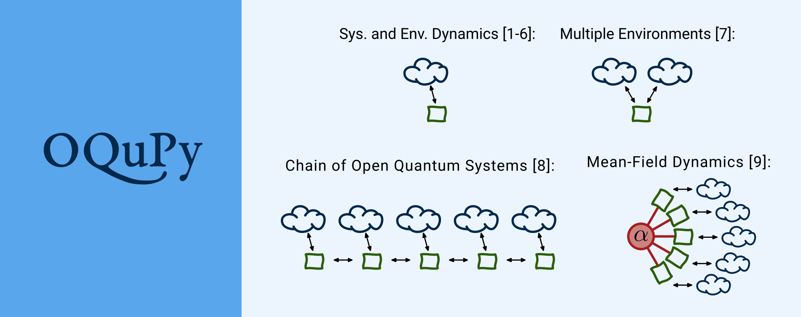

# OQuPy: Open Quantum Systems in Python

**A Python package to efficiently simulate non-Markovian open quantum systems
with process tensors.**

[](https://mybinder.org/v2/gh/tempoCollaboration/OQuPy/main?filepath=tutorials%2Fquickstart.ipynb)
[](https://github.com/tempoCollaboration/OQuPy/actions/workflows/python-package-tests.yml)
[](https://codecov.io/gh/tempoCollaboration/OQuPy)
[](https://oqupy.readthedocs.io/en/latest/?badge=latest)
[](https://github.com/tempoCollaboration/OQuPy/blob/main/CODE_OF_CONDUCT.md)
[](https://www.zenodo.org/badge/latestdoi/244404030)

[](http://unitary.fund)

This open source project aims to facilitate versatile numerical tools to efficiently compute the dynamics of quantum systems that are possibly strongly coupled to structured environments. It facilitates the convenient application of several numerical methods that combine the conceptional advantages of the process tensor framework [1], with the numerical efficiency of tensor networks.

OQuPy includes numerically exact methods (i.e. employing only numerically well controlled approximations) for the non-Markovian dynamics and multi-time correlations of ...
- quantum systems coupled to a single environment [2-4],
- quantum systems coupled to multiple environments [5],
- interacting chains of non-Markovian open quantum systems [6], and
- ensembles of open many-body systems with many-to-one coupling [7].

Furthermore, OQuPy implements methods to ...
- optimize control protocols for non-Markovian open quantum systems [8,9],
- compute the dynamics of an non-Markovian environment [10], and
- obtain the thermal state of a strongly couled quantum system [11].



- **[1]** Pollock et al., [Phys. Rev. A 97, 012127](https://doi.org/10.1103/PhysRevA.97.012127) (2018).
- **[2]** Strathearn et al., [New J. Phys. 19(9), p.093009](https://doi.org/10.1088/1367-2630/aa8744) (2017).
- **[3]** Strathearn et al., [Nat. Commun. 9, 3322](https://doi.org/10.1038/s41467-018-05617-3)
  (2018).
- **[4]** Jørgensen and Pollock, [Phys. Rev. Lett. 123, 240602](https://doi.org/10.1103/PhysRevLett.123.240602) (2019).
- **[5]** Gribben et al., [PRX Quantum 3, 10321](https://doi.org/10.1103/PRXQuantum.3.010321) (2022).
- **[6]** Fux et al., [Phys. Rev. Research 5, 033078 ](https://doi.org/10.1103/PhysRevResearch.5.033078}) (2023).
- **[7]** Fowler-Wright et al., [Phys. Rev. Lett. 129, 173001](https://doi.org/10.1103/PhysRevLett.129.173001) (2022).
- **[8]** Fux et al., [Phys. Rev. Lett. 126, 200401](https://doi.org/10.1103/PhysRevLett.126.200401) (2021).
- **[9]** Butler et al., [Phys. Rev. Lett. 132, 060401 ](https://doi.org/10.1103/PhysRevLett.132.060401}) (2024).
- **[10]** Gribben et al., [Quantum, 6, 847](https://doi.org/10.22331/q-2022-10-25-847) (2022).
- **[11]** Chiu et al., [Phys. Rev. A 106, 012204](https://doi.org/10.1103/PhysRevA.106.012204}) (2022).


-------------------------------------------------------------------------------

## Links

* Github:         <https://github.com/tempoCollaboration/OQupy>
* Documentation:  <https://oqupy.readthedocs.io>
* PyPI:           <https://pypi.org/project/oqupy/>
* Tutorial:       [](https://mybinder.org/v2/gh/tempoCollaboration/OQuPy/main?filepath=tutorials%2Fquickstart.ipynb)

## Installation
You can install OQuPy using pip like this:
```
$ python3 -m pip install oqupy
```

See the
[documentation](https://oqupy.readthedocs.io/en/latest/pages/install.html)
for more information.


## Quickstart Tutorial
[](https://mybinder.org/v2/gh/tempoCollaboration/OQuPy/main?filepath=tutorials%2Fquickstart.ipynb)

Click the `launch binder` button above to start a tutorial in a browser based jupyter notebook (no installation required) or checkout the [tutorial in the documentation](https://oqupy.readthedocs.io/en/latest/pages/tutorials/quickstart.html).


## Contributing
Contributions of all kinds are welcome! Get in touch if you ...
<ul style="list-style: none;">
 <li>... found a bug.</li>
 <li> ... have a question on how to use the code.</li>
 <li> ... have a suggestion, on how to improve the code or documentation.</li>
 <li> ... would like to get involved in writing code or documentation.</li>
 <li> ... have some other thoughts or suggestions.</li>
</ul>

Please, feel free to file an issue in the [Issues](https://github.com/tempoCollaboration/OQuPy/issues) section on GitHub for this. Also, have a look at [`CONTRIBUTING.md`](https://github.com/tempoCollaboration/OQuPy/blob/main/CONTRIBUTING.md) if you want to get involved in the development.

## Citing, Authors and Bibliography
See the files [`HOW_TO_CITE.md`](https://github.com/tempoCollaboration/OQuPy/blob/main/HOW_TO_CITE.md), [`AUTHORS.md`](https://github.com/tempoCollaboration/OQuPy/blob/main/AUTHORS.md) and [`BIBLIOGRAPHY.md`](https://github.com/tempoCollaboration/OQuPy/blob/main/BIBLIOGRAPHY.md).

#### Consider sharing this project:
<p align="center">

</p>
