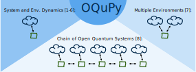

# OQuPy: Open Quantum Systems in Python

**A Python 3 package to efficiently compute non-Markovian open quantum systems.**

[](https://mybinder.org/v2/gh/tempoCollaboration/TimeEvolvingMPO/master?filepath=tutorials%2Ftutorial_01_quickstart.ipynb)
[](https://www.travis-ci.com/tempoCollaboration/TimeEvolvingMPO)
[](https://codecov.io/gh/tempoCollaboration/TimeEvolvingMPO)
[](https://timeevolvingmpo.readthedocs.io/en/latest/?badge=latest)
[](code_of_conduct.md)
[](https://www.zenodo.org/badge/latestdoi/244404030)

[](http://unitary.fund)

This open source project aims to facilitate versatile numerical tools to efficiently compute the dynamics of quantum systems that are possibly strongly coupled to structured environments. It allows to conveniently apply several numerical methods related to the time evolving matrix product operator (TEMPO) [1-2] and the process tensor (PT) approach to open quantum
systems [3-5]. This includes methods to compute ...

- the dynamics of a quantum system strongly coupled to a bosonic environment [1-2].
- the process tensor of a quantum system strongly coupled to a bosonic environment [3-4].
- optimal control procedures for non-Markovian open quantum systems [5].
- the dynamics of a strongly coupled bosonic environment [6].
- the dynamics of a quantum system coupled to multiple non-Markovian environments [7].
- the dynamics of a chain of non-Markovian open quantum systems [8].


Up to versions 0.1.x this package was called *TimeEvolvingMPO*.



- **[1]** Strathearn et al., [New J. Phys. 19(9), p.093009](http://dx.doi.org/10.1088/1367-2630/aa8744) (2017).
- **[2]** Strathearn et al., [Nat. Commun. 9, 3322](https://doi.org/10.1038/s41467-018-05617-3)
  (2018).
- **[3]** Pollock et al., [Phys. Rev. A 97, 012127](http://dx.doi.org/10.1103/PhysRevA.97.012127) (2018).
- **[4]** Jørgensen and Pollock, [Phys. Rev. Lett. 123, 240602](http://dx.doi.org/10.1103/PhysRevLett.123.240602) (2019).
- **[5]** Fux et al., [Phys. Rev. Lett. 126, 200401](https://link.aps.org/doi/10.1103/PhysRevLett.126.200401) (2021).
- **[6]** Gribben et al., [arXiv:2106.04212](http://arxiv.org/abs/2106.04212) (2021).
- **[7]** Gribben et al., [arXiv:2109.08442](http://arxiv.org/abs/2109.08442) (2021).
- **[8]** Fux et al., [arXiv:2201.05529](http://arxiv.org/abs/2201.05529) (2022).

-------------------------------------------------------------------------------

## Links

* Github:         <https://github.com/tempoCollaboration/TimeEvolvingMPO>
* Documentation:  <https://TimeEvolvingMPO.readthedocs.io>
* PyPI:           <https://pypi.org/project/time-evolving-mpo/>
* Tutorial:       [](https://mybinder.org/v2/gh/tempoCollaboration/TimeEvolvingMPO/master?filepath=tutorials%2Ftutorial_01_quickstart.ipynb)


## Installation
You can install OQuPy using pip like this:
```
$ python3 -m pip install oqupy
```

See the
[documentation](https://TimeEvolvingMPO.readthedocs.io/en/latest/pages/install.html)
for more information.


## Quickstart Tutorial
[](https://mybinder.org/v2/gh/tempoCollaboration/TimeEvolvingMPO/master?filepath=tutorials%2Ftutorial_01_quickstart.ipynb)

Click the `launch binder` button above to start a tutorial in a browser based jupyter notebook (no installation required) or checkout the [tutorial in the documentation](https://timeevolvingmpo.readthedocs.io/en/latest/pages/tutorial_01_quickstart/tutorial_01_quickstart.html).


## Contributing
Contributions of all kinds are welcome! Get in touch if you ...
<ul style="list-style: none;">
 <li>... found a bug.</li>
 <li> ... have a question on how to use the code.</li>
 <li> ... have a suggestion, on how to improve the code or documentation.</li>
 <li> ... would like to get involved in writing code or documentation.</li>
 <li> ... have some other thoughts or suggestions.</li>
</ul>

Please, feel free to file an issue in the [Issues](https://github.com/tempoCollaboration/TimeEvolvingMPO/issues) section on GitHub for this. Also, have a look at [`CONTRIBUTING.md`](https://github.com/tempoCollaboration/TimeEvolvingMPO/blob/master/CONTRIBUTING.md) if you want to get involved in the development.

## Citing, Authors and Bibliography
See the files [`HOW_TO_CITE.md`](https://github.com/tempoCollaboration/TimeEvolvingMPO/blob/master/HOW_TO_CITE.md), [`AUTHORS.md`](https://github.com/tempoCollaboration/TimeEvolvingMPO/blob/master/AUTHORS.md) and [`BIBLIOGRAPHY.md`](https://github.com/tempoCollaboration/TimeEvolvingMPO/blob/master/BIBLIOGRAPHY.md).

