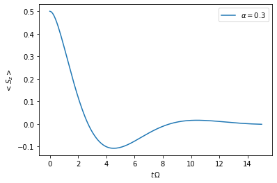
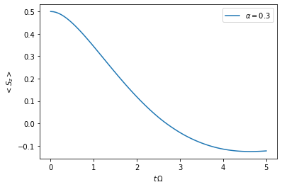
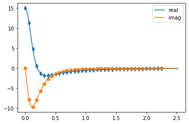
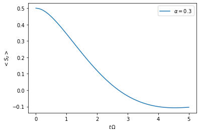
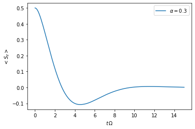

Tutorial 01 - Quickstart
========================

A quick introduction on how to use the TimeEvolvingMPO package to
compute the dynamics of a quantum system that is possibly strongly
coupled to a structured environment. We illustrate this by applying the
TEMPO method to the strongly coupled spin boson model.

**Contents:**

-  Example A - The spin boson model

   -  A.1: The model and its parameters
   -  A.2: Create system, correlations and bath objects
   -  A.3: TEMPO computation

-------------------------------------------------------------------------------

You can follow this tutorial using any of these options:

.. |binder-tutorial| image:: https://mybinder.org/badge_logo.svg
 :target: https://mybinder.org/v2/gh/tempoCollaboration/TimeEvolvingMPO/main?filepath=tutorials%2Ftutorial_01_quickstart.ipynb

- launch binder |binder-tutorial| (runs in browser),
- download the :download:`jupyter file <https://raw.githubusercontent.com/tempoCollaboration/TimeEvolvingMPO/main/tutorials/tutorial_01_quickstart.ipynb>`,
- download the :download:`python3 file <https://raw.githubusercontent.com/tempoCollaboration/TimeEvolvingMPO/main/tutorials/tutorial_01_quickstart.py>`,
- read through it and code along below.

-------------------------------------------------------------------------------

First, let’s import TimeEvolvingMPO and some other packages we are going
to use

.. code:: ipython3

    import sys
    sys.path.insert(0,'..')

    import time_evolving_mpo as tempo
    import numpy as np
    import matplotlib.pyplot as plt
    %matplotlib inline

and check what version of tempo we are using.

.. code:: ipython3

    tempo.__version__

.. parsed-literal::

    '0.1.2'

--------------

Example A - The spin boson model
--------------------------------

As a first example let’s try to reconstruct one of the lines in figure
2a of [Strathearn2018] (`Nat. Comm. 9, 3322
(2018) <https://doi.org/10.1038/s41467-018-05617-3>`__ /
`arXiv:1711.09641v3 <https://arxiv.org/abs/1711.09641>`__). In this
example we compute the time evolution of a spin which is strongly
coupled to an ohmic bath (spin-boson model). Before we go through this
step by step below, let’s have a brief look at the script that will do
the job - just to have an idea where we are going:

.. code:: ipython3

    Omega = 1.0
    omega_cutoff = 5.0
    alpha = 0.3
    
    system = tempo.System(0.5 * Omega * tempo.operators.sigma("x"))
    correlations = tempo.PowerLawSD(alpha=alpha, 
                                    zeta=1, 
                                    cutoff=omega_cutoff, 
                                    cutoff_type='exponential', 
                                    max_correlation_time=8.0)
    bath = tempo.Bath(0.5 * tempo.operators.sigma("z"), correlations)
    tempo_parameters = tempo.TempoParameters(dt=0.1, dkmax=30, epsrel=10**(-4))
    
    dynamics = tempo.tempo_compute(system=system,
                                   bath=bath,
                                   initial_state=tempo.operators.spin_dm("up"),
                                   start_time=0.0,
                                   end_time=15.0,
                                   parameters=tempo_parameters)
    t, s_z = dynamics.expectations(0.5*tempo.operators.sigma("z"), real=True)
    
    plt.plot(t, s_z, label=r'$\alpha=0.3$')
    plt.xlabel(r'$t\,\Omega$')
    plt.ylabel(r'$<S_z>$')
    plt.legend()

.. parsed-literal::

    100.0%  150 of  150 [########################################] 00:00:21
    Elapsed time: 21.7s

.. parsed-literal::

    <matplotlib.legend.Legend at 0x7fd738214550>

A.1: The model and its parameters
~~~~~~~~~~~~~~~~~~~~~~~~~~~~~~~~~

We consider a system Hamiltonian

.. math::  H_{S} = \frac{\Omega}{2} \hat{\sigma}_x \mathrm{,}

a bath Hamiltonian

.. math::  H_{B} = \sum_k \omega_k \hat{b}^\dagger_k \hat{b}_k  \mathrm{,}

and an interaction Hamiltonian

.. math::  H_{I} =  \frac{1}{2} \hat{\sigma}_z \sum_k \left( g_k \hat{b}^\dagger_k + g^*_k \hat{b}_k \right) \mathrm{,}

where :math:`\hat{\sigma}_i` are the Pauli operators, and the
:math:`g_k` and :math:`\omega_k` are such that the spectral density
:math:`J(\omega)` is

.. math::  J(\omega) = \sum_k |g_k|^2 \delta(\omega - \omega_k) = 2 \, \alpha \, \omega \, \exp\left(-\frac{\omega}{\omega_\mathrm{cutoff}}\right) \mathrm{.} 

Also, let’s assume the initial density matrix of the spin is the up
state

.. math::  \rho(0) = \begin{pmatrix} 1 & 0 \\ 0 & 0 \end{pmatrix} 

and the bath is initially at zero temperature.

For the numerical simulation it is advisable to choose a characteristic
frequency and express all other physical parameters in terms of this
frequency. Here, we choose :math:`\Omega` for this and write:

-  :math:`\Omega = 1.0 \Omega`
-  :math:`\omega_c = 5.0 \Omega`
-  :math:`\alpha = 0.3`

.. code:: ipython3

    Omega_A = 1.0
    omega_cutoff_A = 5.0
    alpha_A = 0.3

A.2: Create system, correlations and bath objects
~~~~~~~~~~~~~~~~~~~~~~~~~~~~~~~~~~~~~~~~~~~~~~~~~

To input the operators you can simply use numpy matrices. For the most
common operators you can, more conveniently, use the ``tempo.operators``
module:

.. code:: ipython3

    tempo.operators.sigma("x")

.. parsed-literal::

    array([[0.+0.j, 1.+0.j],
           [1.+0.j, 0.+0.j]])

.. code:: ipython3

    tempo.operators.spin_dm("up")

.. parsed-literal::

    array([[1.+0.j, 0.+0.j],
           [0.+0.j, 0.+0.j]])

System
^^^^^^

.. math::  H_{S} = \frac{\Omega}{2} \hat{\sigma}_x \mathrm{,}

.. code:: ipython3

    system_A = tempo.System(0.5 * Omega_A * tempo.operators.sigma("x"))

Correlations
^^^^^^^^^^^^

.. math::  J(\omega) = 2 \, \alpha \, \omega \, \exp\left(-\frac{\omega}{\omega_\mathrm{cutoff}}\right) 

Because the spectral density is of the standard power-law form,

.. math::  J(\omega) = 2 \alpha \frac{\omega^\zeta}{\omega_c^{\zeta-1}} X(\omega,\omega_c) 

with :math:`\zeta=1` and :math:`X` of the type ``'exponential'`` we
define the spectral density with:

.. code:: ipython3

    correlations_A = tempo.PowerLawSD(alpha=alpha_A, 
                                      zeta=1, 
                                      cutoff=omega_cutoff_A, 
                                      cutoff_type='exponential', 
                                      max_correlation_time=8.0)

Bath
^^^^

The bath couples with the operator :math:`\frac{1}{2}\hat{\sigma}_z` to
the system.

.. code:: ipython3

    bath_A = tempo.Bath(0.5 * tempo.operators.sigma("z"), correlations_A)

A.3: TEMPO computation
~~~~~~~~~~~~~~~~~~~~~~

Now, that we have the system and the bath objects ready we can compute
the dynamics of the spin starting in the up state, from time :math:`t=0`
to :math:`t=5\,\Omega^{-1}`

.. code:: ipython3

    dynamics_A_1 = tempo.tempo_compute(system=system_A,
                                       bath=bath_A,
                                       initial_state=tempo.operators.spin_dm("up"),
                                       start_time=0.0,
                                       end_time=5.0,
                                       tolerance=0.01)

.. parsed-literal::

    ../time_evolving_mpo/tempo.py:523: UserWarning: Estimating parameters for TEMPO computation. No guarantie that resulting TEMPO computation converges towards the correct dynamics! Please refere to the TEMPO documentation and check convergence by varying the parameters for TEMPO manually.
      warnings.warn(GUESS_WARNING_MSG, UserWarning)
    WARNING: Estimating parameters for TEMPO computation. No guarantie that resulting TEMPO computation converges towards the correct dynamics! Please refere to the TEMPO documentation and check convergence by varying the parameters for TEMPO manually.

.. parsed-literal::

    100.0%   80 of   80 [########################################] 00:00:10
    Elapsed time: 10.2s

and plot the result:

.. code:: ipython3

    t_A_1, z_A_1 = dynamics_A_1.expectations(0.5*tempo.operators.sigma("z"), real=True)
    plt.plot(t_A_1, z_A_1, label=r'$\alpha=0.3$')
    plt.xlabel(r'$t\,\Omega$')
    plt.ylabel(r'$<S_z>$')
    plt.legend()

.. parsed-literal::

    <matplotlib.legend.Legend at 0x7fd738085b00>

Yay! This looks like the plot in figure 2a [Strathearn2018].

Let’s have a look at the above warning. It said:

::

   WARNING: Estimating parameters for TEMPO calculation. No guarantie that resulting TEMPO calculation converges towards the correct dynamics! Please refere to the TEMPO documentation and check convergence by varying the parameters for TEMPO manually.

We got this message because we didn’t tell the package what parameters
to use for the TEMPO computation, but instead only specified a
``tolerance``. The package tries it’s best by implicitly calling the
function ``tempo.guess_tempo_parameters()`` to find parameters that are
appropriate for the spectral density and system objects given.

TEMPO Parameters
^^^^^^^^^^^^^^^^

There are **three key parameters** to a TEMPO computation:

-  ``dt`` - Length of a time step :math:`\delta t` - It should be small
   enough such that a trotterisation between the system Hamiltonian and
   the environment it valid, and the environment auto-correlation
   function is reasonably well sampled.

-  ``dkmax`` - Number of time steps :math:`K \in \mathbb{N}` - It must
   be large enough such that :math:`\delta t \times K` is larger than
   the neccessary memory time :math:`\tau_\mathrm{cut}`.

-  ``epsrel`` - The maximal relative error :math:`\epsilon_\mathrm{rel}`
   in the singular value truncation - It must be small enough such that
   the numerical compression (using tensor network algorithms) does not
   truncate relevant correlations.

To choose the right set of initial parameters, we recommend to first use
the ``tempo.guess_tempo_parameters()`` function and then check with the
helper function ``tempo.helpers.plot_correlations_with_parameters()``
whether it satisfies the above requirements:

.. code:: ipython3

    parameters = tempo.guess_tempo_parameters(system=system_A,
                                              bath=bath_A,
                                              start_time=0.0,
                                              end_time=5.0,
                                              tolerance=0.01)
    print(parameters)

.. parsed-literal::

    ../time_evolving_mpo/tempo.py:523: UserWarning: Estimating parameters for TEMPO computation. No guarantie that resulting TEMPO computation converges towards the correct dynamics! Please refere to the TEMPO documentation and check convergence by varying the parameters for TEMPO manually.
      warnings.warn(GUESS_WARNING_MSG, UserWarning)
    WARNING: Estimating parameters for TEMPO computation. No guarantie that resulting TEMPO computation converges towards the correct dynamics! Please refere to the TEMPO documentation and check convergence by varying the parameters for TEMPO manually.

.. parsed-literal::

    ----------------------------------------------
    TempoParameters object: Roughly estimated parameters
     Estimated with 'guess_tempo_parameters()'
      dt            = 0.0625 
      dkmax         = 37 
      epsrel        = 2.4846963223857106e-05 
    

.. code:: ipython3

    fig, ax = plt.subplots(1,1)
    tempo.helpers.plot_correlations_with_parameters(bath_A.correlations, parameters, ax=ax)

.. parsed-literal::

    <AxesSubplot:>

In this plot you see the real and imaginary part of the environments
auto-correlation as a function of the delay time :math:`\tau` and the
sampling of it corresponding the the chosen parameters. The spacing and
the number of sampling points is given by ``dt`` and ``dkmax``
respectively. We can see that the auto-correlation function is close to
zero for delay times larger than approx :math:`2 \Omega^{-1}` and that
the sampling points follow the curve reasonably well. Thus this is a
reasonable set of parameters.

We can choose a set of parameters by hand and bundle them into a
``TempoParameters`` object,

.. code:: ipython3

    tempo_parameters_A = tempo.TempoParameters(dt=0.1, dkmax=30, epsrel=10**(-4), name="my rough parameters")
    print(tempo_parameters_A)

.. parsed-literal::

    ----------------------------------------------
    TempoParameters object: my rough parameters
     __no_description__
      dt            = 0.1 
      dkmax         = 30 
      epsrel        = 0.0001 
    

and check again with the helper function:

.. code:: ipython3

    fig, ax = plt.subplots(1,1)
    tempo.helpers.plot_correlations_with_parameters(bath_A.correlations, tempo_parameters_A, ax=ax)

.. parsed-literal::

    <AxesSubplot:>

.. image:: output_37_1.png

We could feed this object into the ``tempo.tempo_compute()`` function to
get the dynamics of the system. However, instead of that, we can split
up the work that ``tempo.tempo_compute()`` does into several steps,
which allows us to resume a computation to get later system dynamics
without having to start over. For this we start with creating a
``Tempo`` object:

.. code:: ipython3

    tempo_A = tempo.Tempo(system=system_A,
                          bath=bath_A,
                          parameters=tempo_parameters_A,
                          initial_state=tempo.operators.spin_dm("up"),
                          start_time=0.0)

We can start by computing the dynamics up to time
:math:`5.0\,\Omega^{-1}`,

.. code:: ipython3

    tempo_A.compute(end_time=5.0)

.. parsed-literal::

    100.0%   50 of   50 [########################################] 00:00:03
    Elapsed time: 3.2s

.. parsed-literal::

    <time_evolving_mpo.dynamics.Dynamics at 0x7fd738294f28>

then get and plot the dynamics of expecatation values,

.. code:: ipython3

    dynamics_A_2 = tempo_A.get_dynamics()
    plt.plot(*dynamics_A_2.expectations(0.5*tempo.operators.sigma("z"),real=True), label=r'$\alpha=0.3$')
    plt.xlabel(r'$t\,\Omega$')
    plt.ylabel(r'$<S_z>$')
    plt.legend()

.. parsed-literal::

    <matplotlib.legend.Legend at 0x7fd738156cf8>

then continue the computation to :math:`15.0\,\Omega^{-1}`,

.. code:: ipython3

    tempo_A.compute(end_time=15.0)

.. parsed-literal::

    100.0%  100 of  100 [########################################] 00:00:20
    Elapsed time: 21.0s

.. parsed-literal::

    <time_evolving_mpo.dynamics.Dynamics at 0x7fd738294f28>

and then again get and plot the dynamics of expecatation values.

.. code:: ipython3

    dynamics_A_2 = tempo_A.get_dynamics()
    plt.plot(*dynamics_A_2.expectations(0.5*tempo.operators.sigma("z"),real=True), label=r'$\alpha=0.3$')
    plt.xlabel(r'$t\,\Omega$')
    plt.ylabel(r'$<S_z>$')
    plt.legend()

.. parsed-literal::

    <matplotlib.legend.Legend at 0x7fd73832f7b8>

Finally, we note: to validate the accuracy the result **it vital to
check the convergence of such a simulation by varying all three
computational parameters!** For this we recommend repeating the same
simulation with slightly “better” parameters (smaller ``dt``, larger
``dkmax``, smaller ``epsrel``) and to consider the difference of the
result as an estimate of the upper bound of the accuracy of the
simulation.

--------------
