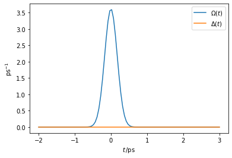
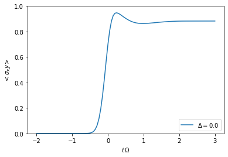
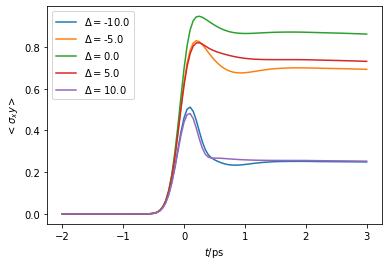

Tutorial 02 - Time dependence and PT-TEMPO
==========================================

A quick introduction on how to use the TimeEvolvingMPO package to
compute the dynamics of a time dependent quantum system and how to
employ the process tensor TEMPO method. We illustrate this by applying
TEMPO and PT-TEMPO to a quantum dot driven by a time dependent laser
pulse.

**Contents:**

-  Example B - Quantum dot driven by a laser pulse

   -  B.1: Hamiltonian for driven quantum dot with bosonic environment
   -  B.2: Laser pulse / time dependent system
   -  B.3: Create time dependent system object
   -  B.4: TEMPO computation
   -  B.5: Using PT-TEMPO to explore many different laser pulses

First, let’s import TimeEvolvingMPO and some other packages we are going
to use

.. code:: ipython3

    import sys
    sys.path.insert(0,'..')
    
    import oqupy as tempo
    import numpy as np
    import matplotlib.pyplot as plt

and check what version of tempo we are using.

.. code:: ipython3

    tempo.__version__

.. parsed-literal::

    '0.1.2'

--------------

Example B - Quantum Dot driven by a laser pulse
-----------------------------------------------

As a first example let’s try to reconstruct one of the lines in figure
3c of [Fux2021] (`Phys. Rev. Lett. 126, 200401
(2021) <https://link.aps.org/doi/10.1103/PhysRevLett.126.200401>`__ /
`arXiv:2101.03071 <https://arxiv.org/abs/2101.03071>`__). In this
example we compute the time evolution of a quantum dot which is driven
with a :math:`\pi/2` laser pulse and is strongly coupled to an ohmic
bath (spin-boson model).

B.1: Hamiltonian for driven quantum dot with bosonic environment
~~~~~~~~~~~~~~~~~~~~~~~~~~~~~~~~~~~~~~~~~~~~~~~~~~~~~~~~~~~~~~~~

We consider a time dependent system Hamiltonian

.. math::  H_{S}(t) = \frac{\Delta(t)}{2} \hat{\sigma}_z + \frac{\Omega(t)}{2} \hat{\sigma}_x \mathrm{,}

which may describe transitions between the ground and exciton state
driven by a resonant laser pulse (in the rotating frame). Here,
:math:`\Delta(t)` is the detuning of the laser with respect to the
transition and :math:`\Omega(t)` is proportional to the electric field
of the laser. We further include a bosonic environment

.. math::  H_{B} = \sum_k \omega_k \hat{b}^\dagger_k \hat{b}_k  \mathrm{,}

and an interaction Hamiltonian

.. math::  H_{I} =  \frac{1}{2} \hat{\sigma}_z \sum_k \left( g_k \hat{b}^\dagger_k + g^*_k \hat{b}_k \right) \mathrm{,}

where :math:`\hat{\sigma}_i` are the Pauli operators, and the
:math:`g_k` and :math:`\omega_k` are such that the spectral density
:math:`J(\omega)` is

.. math::  J(\omega) = \sum_k |g_k|^2 \delta(\omega - \omega_k) = 2 \, \alpha \, \frac{\omega^3}{\omega_\mathrm{cutoff}^2} \, \exp\left(-\frac{\omega^2}{\omega_\mathrm{cutoff}^2}\right) \mathrm{.} 

Also, let’s assume the initial density matrix of the quantum dot is the
ground state

.. math::  \rho_0 = \begin{pmatrix} 0 & 0 \\ 0 & 1 \end{pmatrix} 

and the bath is initially at temperature :math:`T`.

| We express all frequencies, temperatures and times in units of 1/ps
  and ps respectively.
| \* :math:`\omega_c = 3.04 \frac{1}{\mathrm{ps}}` \*
  :math:`\alpha = 0.126` \*
  :math:`T = 1 K = 0.1309 \frac{1}{\mathrm{ps}\,\mathrm{k}_B}`

.. code:: ipython3

    omega_cutoff = 3.04 
    alpha = 0.126
    temperature = 0.1309
    initial_state=tempo.operators.spin_dm("z-")

B.2: Laser pulse / time dependent system
~~~~~~~~~~~~~~~~~~~~~~~~~~~~~~~~~~~~~~~~

We choose a gaussian laser pulse shape with an adjustable pulse area and
pulse width :math:`\tau`.

.. code:: ipython3

    def gaussian_shape(t, area = 1.0, tau = 1.0, t_0 = 0.0):
        return area/(tau*np.sqrt(np.pi)) * np.exp(-(t-t_0)**2/(tau**2))

Choosing a pulse area of :math:`\pi/2`, a pulse width of 245 fs and no
detuning, we can check the shape of the laser pulse.

.. code:: ipython3

    detuning = lambda t: 0.0 * t
    
    t = np.linspace(-2,3,100)
    Omega_t = gaussian_shape(t, area = np.pi/2.0, tau = 0.245)
    Delta_t = detuning(t)
    
    plt.plot(t, Omega_t,label=r"$\Omega(t)$")
    plt.plot(t, Delta_t,label=r"$\Delta(t)$")
    plt.xlabel(r"$t\,/\mathrm{ps}$")
    plt.ylabel(r"$\mathrm{ps}^{-1}$")
    plt.legend()

.. parsed-literal::

    <matplotlib.legend.Legend at 0x7f6a0ad0e3c8>

B.3: Create time dependent system object
~~~~~~~~~~~~~~~~~~~~~~~~~~~~~~~~~~~~~~~~

.. code:: ipython3

    def hamiltonian_t(t):
        return detuning(t)/2.0 * tempo.operators.sigma("z") \
               + gaussian_shape(t, area = np.pi/2.0, tau = 0.245)/2.0 * tempo.operators.sigma("x") 
    
    system = tempo.TimeDependentSystem(hamiltonian_t)
    correlations = tempo.PowerLawSD(alpha=alpha, 
                                    zeta=3, 
                                    cutoff=omega_cutoff, 
                                    cutoff_type='gaussian', 
                                    add_correlation_time=5.0,
                                    temperature=temperature)
    bath = tempo.Bath(tempo.operators.sigma("z")/2.0, correlations)

B.4: TEMPO computation
~~~~~~~~~~~~~~~~~~~~~~

With all physical objects defined, we are now ready to compute the
dynamics of the quantum dot using TEMPO (using quite rough convergence
parameters):

.. code:: ipython3

    tempo_parameters = tempo.TempoParameters(dt=0.1, dkmax=20, epsrel=10**(-4))
    
    tempo_sys = tempo.Tempo(system=system,
                            bath=bath,
                            initial_state=initial_state,
                            start_time=-2.0,
                            parameters=tempo_parameters)
    dynamics = tempo_sys.compute(end_time=3.0)

.. parsed-literal::

    100.0%   50 of   50 [########################################] 00:00:02
    Elapsed time: 2.1s

and extract the expectation values
:math:`\langle\sigma_{xy}\rangle = \sqrt{\langle\sigma_x\rangle^2 + \langle\sigma_y\rangle^2}`
for plotting:

.. code:: ipython3

    t, s_x = dynamics.expectations(tempo.operators.sigma("x"), real=True)
    t, s_y = dynamics.expectations(tempo.operators.sigma("y"), real=True)
    s_xy = np.sqrt(s_x**2 + s_y**2)
    plt.plot(t, s_xy, label=r'$\Delta = 0.0$')
    plt.xlabel(r'$t\,\Omega$')
    plt.ylabel(r'$<\sigma_xy>$')
    plt.ylim((0.0,1.0))
    plt.legend(loc=4)

.. parsed-literal::

    <matplotlib.legend.Legend at 0x7f6a0027f080>

B.5: Using PT-TEMPO to explore many different laser pulses
~~~~~~~~~~~~~~~~~~~~~~~~~~~~~~~~~~~~~~~~~~~~~~~~~~~~~~~~~~

If we want to do the same computation for a set of different laser
pulses (and thus different time dependent system Hamiltonians), we could
repeate the above procedure. However, for a large number of different
system Hamiltonians this is impractical. In such cases one may instead
use the process tensor approach (PT-TEMPO) wherein the bath influence
tensors are computed separately from the rest of the network. This
produces an object known as the process tensor which may then be used
with many different system Hamiltonians at relatively little cost.

.. code:: ipython3

    pt_tempo_parameters = tempo.PtTempoParameters(dt=0.1, dkmax=20, epsrel=10**(-4))
    
    process_tensor = tempo.pt_tempo_compute(bath=bath,
                                            start_time=-2.0,
                                            end_time=3.0,
                                            parameters=pt_tempo_parameters)

.. parsed-literal::

    100.0%   50 of   50 [########################################] 00:00:03
    Elapsed time: 3.0s

Given we want to calculate :math:`\langle\sigma_{xy}\rangle(t)` for 5
different laser pulse detunings, we define a seperate system object for
each laser pulse:

.. code:: ipython3

    deltas = [-10.0, -5.0, 0.0, 5.0, 10.0]
    systems = []
    for delta in deltas:
        # NOTE: omitting "delta=delta" in the parameter definition below
        #       would lead to all systems having the same detuning.
        #       This is a common python pitfall. Check out 
        #       https://docs.python-guide.org/writing/gotchas/#late-binding-closures
        #       for more information on this.
        def hamiltonian_t(t, delta=delta): 
            return delta/2.0 * tempo.operators.sigma("z") \
                + gaussian_shape(t, area = np.pi/2.0, tau = 0.245)/2.0 * tempo.operators.sigma("x") 
        system = tempo.TimeDependentSystem(hamiltonian_t)
        systems.append(system)

We can then use the process tensor to compute the dynamics for each
laser pulse

.. code:: ipython3

    s_xy_list = []
    t_list = []
    for system in systems:
        dynamics = process_tensor.compute_dynamics_from_system(
            system=system, 
            initial_state=initial_state)
        t, s_x = dynamics.expectations(tempo.operators.sigma("x"), real=True)
        _, s_y = dynamics.expectations(tempo.operators.sigma("y"), real=True)
        s_xy = np.sqrt(s_x**2 + s_y**2)
        s_xy_list.append(s_xy)
        t_list.append(t)   
        print(".", end="", flush=True)
    print(" done.", flush=True)

.. parsed-literal::

    ..... done.

and plot :math:`\langle\sigma_{xy}\rangle(t)` for each:

.. code:: ipython3

    for t, s_xy, delta in zip(t_list, s_xy_list, deltas):
        plt.plot(t, s_xy, label=r"$\Delta = $"+f"{delta:0.1f}")
        plt.xlabel(r'$t/$ps')
        plt.ylabel(r'$<\sigma_xy>$')
    plt.ylim((0.0,1.0))
    plt.legend()

.. parsed-literal::

    <matplotlib.legend.Legend at 0x7f6a00346c18>

