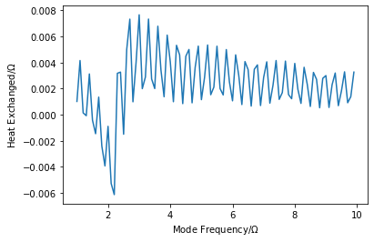

Environment Dynamics
====================

An example on how to compute the dynamics of a gaussian bosonic
environment using the OQuPy package.

-  `launch
   binder <https://mybinder.org/v2/gh/tempoCollaboration/OQuPy/HEAD?labpath=tutorials%2Fbath_dynamics.ipynb>`__
   (runs in browser),
-  `download the jupyter
   file <https://raw.githubusercontent.com/tempoCollaboration/OQuPy/main/tutorials/bath_dynamics.ipynb>`__,
   or
-  read through the text below and code along.

First let’s import the necessary packages

.. code:: ipython3

    import sys
    sys.path.insert(0,'..')
    import oqupy
    import matplotlib.pyplot as plt
    import numpy as np

and define the necessary spin matrices for convenience

.. code:: ipython3

    spin_down = oqupy.operators.spin_dm("down")
    s_z = 0.5*oqupy.operators.sigma("z")
    s_x = 0.5*oqupy.operators.sigma("x")

Example - Heat transfer in a biased spin-boson model
----------------------------------------------------

Let’s try and recreate a line cut of Figure 2 from [Gribben2021]
(`arXiv:2106.04212 <https://arxiv.org/abs/2106.04212>`__). This tells us
how much heat has been emitted into or absorbed from the bath by the
system and how this transfer is distributed over the bath modes.

1. Hamiltonian - Biased spin-boson model
~~~~~~~~~~~~~~~~~~~~~~~~~~~~~~~~~~~~~~~~

The system Hamiltonian we consider is:

.. math:: H_S = \epsilon s_z + \Omega s_x

describing a spin-:math:`\frac{1}{2}` particle with energy splitting
:math:`\epsilon` and transition frequency :math:`\Omega`. Here
:math:`s_i = \sigma_i/2` where :math:`\sigma_i` are the Pauli matrices.

The interaction Hamiltonian is given by:

.. math:: H_I = {s_z} \sum_k g_k \left(a_k+a_k^\dagger\right),

and the bath Hamiltonian by:

.. math:: H_B = \sum_k \omega_k a_k^\dagger a_k.

This describes a linear coupling to bosons of frequency :math:`\omega_k`
with strength :math:`g_k`. These bosons are described by the ladder
operators :math:`a_k` and :math:`a^\dagger_k` which satisfy the
canonical commutation relations:

.. math::  \left[a_k,a_{k'}^\dagger\right]=\delta_{kk'},

.. math::  \left[a_k,a_{k'}\right]=\left[a_k^\dagger,a_{k'}^\dagger\right] = 0.

We can characterise the bath entirely by its spectral density:

.. math::  J(\omega) = \sum_k |g_k|^2 \delta(\omega - \omega_k) = 2 \, \alpha \, \omega \, \exp\left(-\frac{\omega}{\omega_\mathrm{cutoff}}\right) \mathrm{,} 

where we have decided on an Ohmic spectral density with dimensionless
coupling strength :math:`\alpha` and high-frequency cutoff
:math:`\omega_c`.

Also, let’s assume the initial density matrix of the spin is the down
state

.. math::  \rho_S(0) = \begin{pmatrix} 0 & 0 \\ 0 & 1 \end{pmatrix} 

\ and the bath is initially in thermal equilibrium at :math:`T=\Omega`.

For the rest of the parameters we choose to set:

-  :math:`\epsilon = 2.0 \Omega`
-  :math:`\omega_c = 10.0 \Omega`
-  :math:`\alpha = 0.05`

2. Building the process tensor
~~~~~~~~~~~~~~~~~~~~~~~~~~~~~~

The setting up of the system and general running of TEMPO/PT-TEMPO has
been covered in detail in the previous tutorials so for now let us go
right ahead and build a process tensor for this spectral density. Here
we’ll use much rougher convergence parameters than in the paper, the
qualitative result is not really changed though.

.. code:: ipython3

    Omega = 1
    alpha = 0.05
    w_cutoff = 10 * Omega
    epsilon = 2 * Omega
    dkmax = 10
    epsrel = 1e-5
    final_t = 20
    delta_t = 0.2
    initial_state = spin_down
    corr = oqupy.PowerLawSD(alpha, 1, w_cutoff, temperature = 1)
    pars = oqupy.TempoParameters(delta_t, dkmax, epsrel)
    system = oqupy.System(Omega*s_x + epsilon*s_z)
    bath = oqupy.Bath(s_z, corr)
    pt = oqupy.PtTempo(bath, 0.0, final_t, pars)
    pt = pt.get_process_tensor(progress_type='bar')

.. parsed-literal::

    --> PT-TEMPO computation:
    100.0%  100 of  100 [########################################] 00:00:03
    Elapsed time: 3.1s

Now as we saw previously the process tensor can readily be used to
calculate system dynamics, for example let’s look at how the density
matrix elements evolve.

.. code:: ipython3

    dyns = oqupy.contractions.compute_dynamics(
        system=system,
        initial_state=initial_state,
        process_tensor=pt)
    times, states = dyns.times, dyns.states
    plt.plot(times, states[:,0,0].real, label=r'$\rho_{00}$')
    plt.plot(times, states[:,0,1].real, label=r'$\Re[\rho_{01}]$')
    plt.plot(times, states[:,0,1].imag, label=r'$\Im[\rho_{01}]$')
    plt.xlabel(r"$\Omega t$")
    plt.ylabel(r"Amplitude")
    plt.legend()

.. parsed-literal::

    --> Compute dynamics:
    100.0%  100 of  100 [########################################] 00:00:00
    Elapsed time: 0.4s

.. parsed-literal::

    <matplotlib.legend.Legend at 0x7ff2e5df9da0>

.. image:: output_10_2.png

Already the process tensor tells us everything we could want to know
about the system but actually we can infer a lot about how the bath
behaves as well.

3. Bath dynamics
~~~~~~~~~~~~~~~~

In [Gribben2021]
(`arXiv:2106.04212 <https://arxiv.org/abs/2106.04212>`__) we can see
that for linearly coupled Gaussian environments the bath dynamics can be
calculated through relatively simple transformations of system
correlation functions. For example the change in energy of mode
:math:`k` can be expressed as

.. math::  \omega_k\left\langle a_k^\dagger (t) a_k (t)-a_k^\dagger (0) a_k (0) \right\rangle = \omega_k g_k^2 \int_0^t dt' \int_0^t dt'' \left\langle s_z(t')s_z(t'')\right\rangle F(\omega_k, t', t'', T), 

with

.. math::  F(\omega, t', t'', T) := \cos[\omega (t'-t'')]-i \sin[\omega(t'-t'')]\coth(\omega /2T). 

However we typically take the continuum limit in which case the coupling
to any single mode becomes infinitesimal and it makes more sense to talk
about how heat is exchanged within a band of modes
:math:`(\omega-\delta/2,\omega+\delta/2)`. This gives us the expression:

.. math::  \Delta Q (\omega,t) = \int_{\omega-\delta/2}^{\omega+\delta/2}d\omega' \omega' J(\omega') \int_0^t dt' \int_0^t dt'' \left\langle s_z(t')s_z(t'')\right\rangle F(\omega', t', t'', T),

.. math::  \Delta Q (\omega,t) \approx  \omega J(\omega)\delta \int_0^t dt' \int_0^t dt'' \left\langle s_z(t')s_z(t'')\right\rangle F(\omega', t', t'', T),

where
:math:`\left\langle s_z(t')s_z(t'')\right\rangle = \mathrm{Tr} [s_z(t')s_z(t'')\rho]`
and we have approximated the integrand as constant over the bandwidth.
The validity of this is reliant on the system relaxing much faster than
the timescale set by :math:`\delta^{-1}`.

To be compatible with PT-TEMPO we must now discretise this expression
according into timesteps, a rough discretisation can be expressed as:

.. math:: \Delta Q (\omega,t_N) \approx  \omega J(\omega)\delta \sum_{k=0}^{N-1} \sum_{k'=0}^{N-1}  \left\langle s_z(t_k)s_z(t_{k'})\right\rangle F(\omega,t_k,t_{k'},T) \, dt^2.

Here :math:`dt` is the same timestep set as the convergence parameter in
PT-TEMPO and we have defined timesteps :math:`t_k = k dt`. In practice
this discretisation breaks down at large :math:`\omega`, the actual
implementation does something slightly more sophisticated which will be
detailed elsewhere.

To calculate this in OQuPy we begin by initialising a
``TwoTimeBathCorrelations`` object from the ``bath_dynamics`` module:

.. code:: ipython3

    bath_corr = oqupy.bath_dynamics.TwoTimeBathCorrelations(system, bath, pt, initial_state)

As inputs this requires everything necessary to calculate the system
correlation functions: \* ``system``: the system Hamiltonian. \*
``bath``: characterises bath containing information about its spectral
density and temperature. \* ``process_tensor``: the process tensor which
when combined with the system Hamiltonian can be used to calculate any
system correlation function. \* ``initial_state``: the initial system
density matrix which must be either built into the process tensor or
input here.

We can now use the method ``occupation`` to calculate the energy
dynamics of a particular mode by multiplying the output by its
frequency, in this case let’s look at ``w = Omega`` and a bandwidth of
``delta = 0.1 * Omega``:

.. code:: ipython3

    w = Omega
    delta = 0.1 * Omega
    tlist, occ = bath_corr.occupation(w, delta, change_only = True)
    energy = w * occ
    plt.plot(tlist,energy)
    plt.xlabel(r'$\Omega t$')
    plt.ylabel(r'$\Delta Q ( \Omega, t)$')

.. parsed-literal::

    --> Compute correlations:
    100.0%  100 of  100 [########################################] 00:00:14
    Elapsed time: 14.4s

.. parsed-literal::

    Text(0, 0.5, '$\\Delta Q ( \\Omega, t)$')

.. image:: output_14_2.png

…that took quite a while. From the expression for :math:`\Delta Q` is
would seem that to calculate the change in energy of the bath up to time
:math:`t_N` requires the :math:`N^2` two-time system correlation
functions. In fact we only need the :math:`N(N+1)/2` time-ordered
correlation functions due to
:math:`\left\langle s_z(t_{k'})s_z(t_{k})\right\rangle = \left\langle s_z(t_{k})s_z(t_{k'})\right\rangle^*`.
However, this can still be quite time-consuming to calculate, but let’s
see what happens if we want the energy of another mode now, let’s say
``w = 2 * Omega``

.. code:: ipython3

    w = 2 * Omega
    delta = 0.1 * Omega
    tlist, occ = bath_corr.occupation(w, delta, change_only = True)
    energy = w * occ
    plt.plot(tlist, energy)
    plt.xlabel(r'$\Omega t$')
    plt.ylabel(r'$\Delta Q (2 \Omega, t)$')

.. parsed-literal::

    Text(0, 0.5, '$\\Delta Q (2 \\Omega, t)$')

.. image:: output_16_1.png

Much quicker! This is because the same set of system correlation
functions can be used to compute any bath correlation function
:math:`\langle \alpha_2(t_2)\alpha_1(t_1)\rangle` where
$:raw-latex:`\alpha`\_2, :raw-latex:`\alpha`\_1
:raw-latex:`\in `{a_k^:raw-latex:`\dagger`,a_k} $ and
:math:`t_1,t_2 < t_N`. So now we see the logic of having a bath_dynamics
object, it allows us to conveniently store the calculated system
correlation functions and re-use them as we like :)

4. Recreating Figure 2
~~~~~~~~~~~~~~~~~~~~~~

Now we have all the tools necessary to recreate the study of total heat
exchanged as a function of :math:`\epsilon`. However, this would take a
while as we would need a new set of correlation functions for each
:math:`\epsilon`. Here we will just look at the case where
:math:`\epsilon = 2\Omega`. We are only interested in the total heat
exchanged over the process so simply look at the final value of
:math:`\Delta Q`.

.. code:: ipython3

    heat_list = []
    freq_list = np.arange(1, 10, 0.1)
    for w in freq_list:
        tlist, occ = bath_corr.occupation(w, 0.1, True)
        heat_list.append(w * occ[-1])
    plt.plot(freq_list, heat_list)
    plt.xlabel(r"Mode Frequency$/\Omega$")
    plt.ylabel(r"Heat Exchanged$/\Omega$")

.. parsed-literal::

    Text(0, 0.5, 'Heat Exchanged$/\\Omega$')

This is highly oscillatory, perhaps unsurprising from the dynamics we
generated but still it would be nice to smooth this out. We expect the
result to eventually equilibrate but with such a small bandwidth this
will take a while, instead we simply period-average the result. The
period at which each mode oscillates is :math:`T(\omega)=2\pi/\omega` so
we average over the last :math:`n` timesteps where
:math:`(n+1) dt \geq T(\omega) > n dt`.

.. code:: ipython3

    heat_list = []
    freq_list = np.arange(0.05, 10, 0.1)
    for w in freq_list:
        tlist, occ = bath_corr.occupation(w, 0.1, True)
        sel = tlist > (tlist[-1] - 2 * np.pi/w)
        energy = occ * w
        period_averaged_energy = np.mean(energy[sel])
        heat_list.append(period_averaged_energy)
    plt.plot(freq_list, heat_list)
    plt.xlabel(r"Mode Frequency$/\Omega$")
    plt.ylabel(r"Heat Exchanged$/\Omega$")

.. parsed-literal::

    Text(0, 0.5, 'Heat Exchanged$/\\Omega$')

.. image:: output_20_1.png

Here, as in the paper, we see heat is absorbed by the system from the
band of the modes in the vicinity of
:math:`\tilde{\Omega}=\sqrt{\Omega^2+\epsilon^2}`. This seems sensible
as in a Markovian theory the system would sample the environment purely
at its eigensplitting :math:`\tilde{\Omega}`.

--------------
