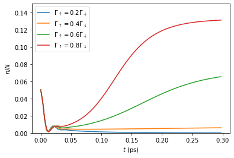

Mean-Field Dynamics
===================

In this tutorial we discuss to use TEMPO and the process tensor approach
to compute the dynamics of a many-body system of the type introduced in
[FowlerWright2021]
(`arXiv:2112.09003 <http://arxiv.org/abs/2112.09003>`__).

**Contents:**

1. Background and introduction

   -  many-body system and environment Hamiltonians
   -  system Hamiltonian and field equation of motion after the
      mean-field reduction

2. Creating time-dependent system with field and bath objects
3. TEMPO computation for single dynamics
4. PT-TEMPO computation for multiple sets of dynamics

We firstly import OQuPy and other useful packages:

.. code:: ipython3

    import sys
    sys.path.insert(0,'..')
    import oqupy
    import numpy as np
    import matplotlib.pyplot as plt

Check the current OQuPy version; mean-field functionality was introduced
in version **0.3.0**

.. code:: ipython3

    oqupy.__version__

.. parsed-literal::

    '0.2.0'

The following matrices will be useful below:

.. code:: ipython3

    sigma_z = oqupy.operators.sigma("z")
    sigma_plus = oqupy.operators.sigma("+")
    sigma_minus = oqupy.operators.sigma("-")

--------------

1. Background and introduction
------------------------------

Our goal will be to reproduce a line from **Fig. 2a.** of
[FowlerWright2021]
(`arXiv:2112.09003 <http://arxiv.org/abs/2112.09003>`__) which shows the
photon number dynamics for the driven-dissipative system of molecules in
a single-mode cavity.

Many-body system and environment Hamiltonian
~~~~~~~~~~~~~~~~~~~~~~~~~~~~~~~~~~~~~~~~~~~~

The Hamiltonian describing the many-body system with one-to-all
light-matter coupling is

.. math::

   H_{S} = \omega_c a^{\dagger}_{}a^{\vphantom{\dagger}}_{} 
       + \sum_{i=1}^N \left[\frac{\omega_0}{2} \sigma^z_i
       +  \frac{\Omega}{2\sqrt{N}} \left( a^{\vphantom{\dagger}}_{} \sigma^+_i + a^{\dagger}_{} \sigma^-_i \right)\right]

Together with the vibrational environment of each molecule,

.. math::

       H_{E}^{(i)} = \sum_{j} \left[   \nu_{j} b^{\dagger}_{j} b^{\vphantom{\dagger}}_{j} 
       + \frac{\xi_{j}}{2} (b^{\vphantom{\dagger}}_{j}+b^{\dagger}_{j})\sigma^z_i\right]\text{.}

This is taken to be a continuum of low frequency modes with coupling
characterized by a spectral density with a ‘Gaussian’ cut-off

.. math::

   \begin{align*}
   J(\nu) &= \sum_{j}  \left(\frac{\xi_j}{2}\right)^2
   \delta(\nu-\nu_j)= 2\alpha \nu e^{-(\nu/\nu_c)^2}\text{,} \quad \nu>0\text{,}
   \end{align*}

where :math:`\alpha=0.25` is the unit-less coupling strenght and
:math:`\hbar \nu_c = 0.15` eV is a cutoff frequency for the environment
of the BODIPY-Br molecule considered in the Letter. For the numericla
simulation we here choose to express all frequencies as angular
frequencies in the units of :math:`\frac{1}{\text{ps}}` (setting
:math:`\hbar = k_B = 1`) and all times in units of ps. The parameters
relevant to **Fig. 2a.** given in those units are:

-  :math:`\nu_c = 0.15 \text{eV} = 227.9 \frac{1}{\text{ps}}` …
   environment cutoff frequency
-  :math:`T = 300 \text{K} = 39.3 \frac{1}{\text{ps}}` … environment
   temperature
-  :math:`\omega_0 = 0.0 \frac{1}{\text{ps}}` … two-level system
   frequency **\***
-  :math:`\omega_c = -0.02 \text{eV} = -30.4 \frac{1}{\text{ps}}` … bare
   cavity frequency
-  :math:`\Omega = 0.2 \text{eV} = 303.9 \frac{1}{\text{ps}}` …
   collective light-matter coupling

together with the rates

-  :math:`\kappa = 15.2 \frac{1}{\text{ps}}` … field decay
-  :math:`\Gamma_\downarrow = 30.4 \frac{1}{\text{ps}}` … electronic
   dissipation
-  :math:`\Gamma_\uparrow \in (0.2\Gamma_\downarrow, 0.8\Gamma_\downarrow)`
   … electronic pumping

The latter appear as prefactors for Markovian terms in the quantum
master equation for the total density operator

.. math::

   \partial_t \rho = -i \biggl[ H_S + \sum_{i=1}^N H_E^{(i)}, \rho \biggr]
       + 2 \kappa \mathcal{L}[a^{\vphantom{\dagger}}_{}]
       + \sum_{i=1}^N (\Gamma_\uparrow \mathcal{L}[\sigma^+_i]
       +  \Gamma_\downarrow \mathcal{L}[\sigma^-_i])\text{.}

As indicated, it is the pump strength :math:`\Gamma_\uparrow` that is
varied to generate the different lines of **Fig. 2a.** In this tutorial
we generate the :math:`\Gamma_\uparrow=0.8\,\Gamma_\downarrow` line
using the TEMPO method, and then the Process Tensor approach to
calculate all of the lines efficiently.

The following code box defines each of the above parameters.

**\* N.B.** for calculating the dynamics only the detuning
:math:`\omega_c-\omega_0` is relevant, so we set :math:`\omega_0=0` for
convenience.

.. code:: ipython3

    alpha = 0.25
    nu_c = 227.9
    T = 39.3
    omega_0 = 0.0
    omega_c = -30.4
    Omega = 303.9
    
    kappa = 15.2
    Gamma_down = 30.4
    Gamma_up = 0.8 * Gamma_down

System Hamiltonian and field equation of motion after the mean-field reduction
~~~~~~~~~~~~~~~~~~~~~~~~~~~~~~~~~~~~~~~~~~~~~~~~~~~~~~~~~~~~~~~~~~~~~~~~~~~~~~

The mean-field approach is based on a product-state ansatz for the total
density operator :math:`\rho`,

.. math::

   \rho = \rho_a \otimes \bigotimes_{i=1}^N \rho_i,\quad \rho_a= \text{Tr}_{\otimes{i}}\rho,\quad \rho_i = \text{Tr}_{a, \otimes{j\neq i}} \rho,

where :math:`\text{Tr}_{\otimes{i}}` denotes a partial trace taken over
the Hilbert space of all two-level systems and
:math:`\text{Tr}_{a, \otimes{j\neq i}}` the trace over the photonic
degree of freedom and all but the :math:`i^{\text{th}}` two-level
system. As detailed in the Supplement of the Letter, after rescaling the
field :math:`\langle a \rangle \to \langle a \rangle/\sqrt{N}`
(:math:`\langle a \rangle` scales with :math:`\sqrt{N}` in the lasing
phase), the dynamics are controlled by the mean-field Hamiltonian
:math:`H_{\text{MF}}` for a *single molecule,*

.. math::

       H_\text{MF} = 
    \frac{\omega_0}{2}\sigma^z+
       \frac{\Omega}{2}\left( \langle a \rangle \sigma^+ +
       \langle a \rangle^{*}\sigma^- \right)\text{,}

together with the equation of motion for the field
:math:`\langle a \rangle`,

.. math::

   \partial_t \langle a \rangle = 
       - (i\omega_c+\kappa)\langle a \rangle- i \frac{\Omega}{2}\langle\sigma^-\rangle.

Therefore in order to calculate the dynamics we need to encode the
field’s equation of motion in addition to the Hamiltonian for a single
two level-system :math:`\rho_i` (which we identify as the ‘system’ in
our TEMPO computation).

In OQuPy, the relevant classes and methods hence all have the
``WithField`` suffix: ``TimeDependentSystemWithField``,
``DynamicsWithField``, ``TempoWithField`` (TEMPO) and
``compute_dynamics_with_field()`` (PT-TEMPO).

2. Creating time-dependent system with field and bath objects
-------------------------------------------------------------

A ``TimedependentSystemWithField`` object requires two physical inputs:
a Hamiltonian, which is a function of time :math:`t` and field
:math:`\langle a \rangle` (in that order), and a equation of motion for
the field, which is a function of time :math:`t`, system state
:math:`\rho_i` and field :math:`\langle a \rangle`. Positional arguments
are used for these functions, so the order of arguments matters whilst
their name does not:**\***

.. code:: ipython3

    def H_MF(t, a):
        return 0.5 * omega_0 * sigma_z +\
            0.5 * Omega * (a * sigma_plus + np.conj(a) * sigma_minus)
    def field_eom(t, state, a):
        expect_val = np.matmul(sigma_minus, state).trace()
        return -(1j * omega_c + kappa) * a - 0.5j * Omega * expect_val

Note :math:`\rho_i` is provided as a :math:`2\times2` matrix, hence to
compute the expectation :math:`\langle \sigma^- \rangle` we used matrix
multiplication with :math:`\sigma^-` and took the trace. It’s a good
idea to test these functions:

.. code:: ipython3

    test_field = 1.0+1.0j
    test_time = 0.01
    test_state = np.array([[0.0,2j],[-2j,1.0]])
    print('H_eval =', H_MF(test_time, test_field))
    print('EOM_eval =', field_eom(test_time, test_state, test_field))

.. parsed-literal::

    H_eval = [[  0.    +0.j   151.95+151.95j]
     [151.95-151.95j   0.    +0.j  ]]
    EOM_eval = (258.29999999999995+15.2j)

Secondly, we need to specify Lindblad operators for the pumping and
dissipation processes:

.. code:: ipython3

    gammas = [ lambda t: Gamma_down, lambda t: Gamma_up]
    lindblad_operators = [ lambda t: sigma_minus, lambda t: sigma_plus]

Here the rates and Lindblad operators must be callables taking a single
argument - time - even though in our example there is no time-dependence
(see **\*** below). The system-field object is then constructed with

.. code:: ipython3

    system = oqupy.TimeDependentSystemWithField(
            H_MF,
            field_eom,
            gammas=gammas,
            lindblad_operators=lindblad_operators)

Correlations and a Bath object are created in the same way as in any
other TEMPO computation (refer to preceding tutorials):

.. code:: ipython3

    correlations = oqupy.PowerLawSD(alpha=alpha,
                                    zeta=1,
                                    cutoff=nu_c,
                                    cutoff_type='gaussian',
                                    temperature=T)
    bath = oqupy.Bath(0.5 * sigma_z, correlations)

**\*** In particular both functions must have a first argument
representing time, even if the problem - as here - has no explicit
time-dependence (for codebase simplicity there is no ``SystemWithField``
class).

3. TEMPO computation for single dynamics
----------------------------------------

For our simulations we use the same initial conditions for the system
and state used in the Letter:

.. code:: ipython3

    initial_field = np.sqrt(0.05) # Note n_0 = <a^dagger a>(0) = 0.05
    initial_state = np.array([[0,0],[0,1]]) # spin down

To reduce the computation time we simulate only the first 0.3 ps of the
dynamics with much rougher convergence parameters compared to the
letter.

.. code:: ipython3

    tempo_parameters = oqupy.TempoParameters(dt=3.2e-3, dkmax=20, epsrel=10**(-5))
    start_time = 0.0
    end_time = 0.3

The ``oqupy.TempoWithField.compute`` method may then be used to compute
the dynamics in exactly the same way a call to ``oqupy.Tempo.compute``
is used to compute the dynamics for an ordinary ``System`` or
``TimeDependentSystem``:

.. code:: ipython3

    tempo_sys = oqupy.TempoWithField(system=system,
                                     bath=bath,
                                     initial_state=initial_state,
                                     initial_field=initial_field,
                                     start_time=start_time,
                                     parameters=tempo_parameters)
    dynamics_with_field = tempo_sys.compute(end_time=end_time)

.. parsed-literal::

    --> TEMPO-with-field computation:
    100.0%   93 of   93 [########################################] 00:00:18
    Elapsed time: 18.7s

``TempoWithField.compute`` returns a ``DynamicsWithField`` object
containing both the state matrices and field values at each timestep, in
addition to the timesteps themselves:

.. code:: ipython3

    times = dynamics_with_field.times
    states = dynamics_with_field.states
    fields = dynamics_with_field.fields

We plot a the square value of the fields i.e. the photon number,
producing the first part of a single line of **Fig. 2a.**:

.. code:: ipython3

    n = np.abs(fields)**2
    plt.plot(times, n, label=r'$\Gamma_\uparrow = 0.8\Gamma_\downarrow$')
    plt.xlabel(r'$t$ (ps)')
    plt.ylabel(r'$n/N$')
    plt.ylim((0.0,0.15))
    plt.legend(loc='upper left')

.. parsed-literal::

    <matplotlib.legend.Legend at 0x7f920a714208>

.. image:: output_32_1.png

If you have the time you can calculate the dynamics to
:math:`t=1.3\,\text{ps}` as in the Letter and check that, even for these
very rough parameters, the results are reasonable close to being
converged with respect to ``dt``, ``dkmax`` and ``epsrel``.

While you could repeat the TEMPO computation for each pump strength
:math:`\Gamma_\uparrow` appearing in **Fig. 2a.**, a more efficient
solution for calculating dynamics for multiple sets of system parameters
(in this case Lindblad rates) is provided by PT-TEMPO.

4. PT-TEMPO computation for multiple sets of dynamics
-----------------------------------------------------

The above calculation can be performed quickly for many-different pump
strengths :math:`\Gamma_\uparrow` using a single process tensor.

As discussed in the Supplement Material for the Letter, there is no
guarantee that computational parameters that gave a set of converged
results for the TEMPO method will give converged results for a PT-TEMPO
calculation. For the sake of this tutorial however let’s assume the
above parameters continue to be reasonable. The process tensor to time
:math:`t=0.3\,\text{ps}` is calculated using these parameters and the
bath via

.. code:: ipython3

    process_tensor = oqupy.pt_tempo_compute(bath=bath,
                                            start_time=0.0,
                                            end_time=0.3,
                                            parameters=tempo_parameters)

.. parsed-literal::

    --> PT-TEMPO computation:
    100.0%   93 of   93 [########################################] 00:00:06
    Elapsed time: 6.3s

Refer the Time Dependence and PT-TEMPO tutorial for further discussion
of the process tensor.

To calculate the dynamics for the 4 different pump strengths in **Fig.
2a.**, we define a separate system with field object for each pump
strength. Only the ``gammas`` array needs to be modified constructor
calls:

.. code:: ipython3

    pump_ratios = [0.2, 0.4, 0.6, 0.8]
    systems = []
    for ratio in pump_ratios:
        Gamma_up = ratio * Gamma_down
        # N.B. a default argument is used to avoid the late-binding closure issue
        # discussed here: https://docs.python-guide.org/writing/gotchas/#late-binding-closures
        gammas = [ lambda t: Gamma_down, lambda t, Gamma_up=Gamma_up: Gamma_up]
         # Use the same Hamiltonian, equation of motion and Lindblad operators
        system = oqupy.TimeDependentSystemWithField(H_MF,
            field_eom,
            gammas=gammas,
            lindblad_operators=lindblad_operators)
        systems.append(system)

We can then use ``compute_dynamics_with_field`` to compute the dynamics
at each :math:`\Gamma_\uparrow` for the particular initial condition
using the process tensor calculated above:

.. code:: ipython3

    t_list = []
    n_list = []
    for i,system in enumerate(systems):
        dynamics = oqupy.compute_dynamics_with_field(
            process_tensor=process_tensor,
            system=system,
            initial_state=initial_state,
            initial_field=initial_field,
            start_time=0.0)
        t = dynamics.times
        fields = dynamics.fields
        n = np.abs(fields)**2
        t_list.append(t)
        n_list.append(n)

.. parsed-literal::

    --> Compute dynamics with field:
    100.0%   93 of   93 [########################################] 00:00:14
    Elapsed time: 14.0s
    --> Compute dynamics with field:
    100.0%   93 of   93 [########################################] 00:00:14
    Elapsed time: 14.8s
    --> Compute dynamics with field:
    100.0%   93 of   93 [########################################] 00:00:14
    Elapsed time: 14.5s
    --> Compute dynamics with field:
    100.0%   93 of   93 [########################################] 00:00:14
    Elapsed time: 14.1s

Finally, plotting the results:

.. code:: ipython3

    for i,n in enumerate(n_list):
        ratio = pump_ratios[i]
        label = r'$\Gamma_\uparrow = {}\Gamma_\downarrow$'.format(pump_ratios[i])
        plt.plot(t_list[i], n_list[i], label=label)
    plt.xlabel(r'$t$ (ps)')
    plt.ylabel(r'$n/N$')
    plt.ylim((0.0,0.15))
    plt.legend(loc='upper left')

.. parsed-literal::

    <matplotlib.legend.Legend at 0x7f920a5ee438>

