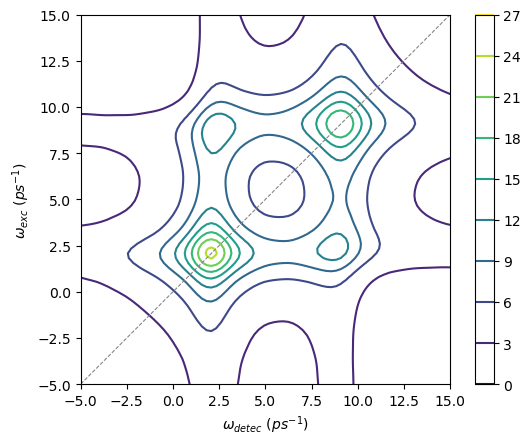

Multi-time correlations
=======================

In this tutorial, we show how to use the OQuPy package to calculate
multi-time correlations functions for non-Markovian open quantum
systems. We will calculate a series of four-time correlation functions
to simulate a 2D electronic spectoscopy measurement.

-  `launch
   binder <https://mybinder.org/v2/gh/tempoCollaboration/OQuPy/HEAD?labpath=tutorials%2Fn_time_correlations.ipynb>`__
   (runs in browser)
-  `download the jupyter
   file <https://raw.githubusercontent.com/tempoCollaboration/OQuPy/main/tutorials/n_time_correlations.ipynb>`__
-  or read through the text below and code along.

**Contents:**

-  Background - 2D electronic spectroscopy
-  Example - A three-level chromophore

   -  

      1. Computing the process tensor

   -  

      2. Define the system and dipole operators

   -  

      3. Calculate four-time correlation functions

   -  

      4. Plot a 2D spectrum

To start, we import OQuPy and some packages we need to Fourier transform
and plot the results:

.. code:: ipython3

    import sys
    sys.path.insert(0,'..')
    
    import oqupy
    from oqupy.contractions import compute_nt_correlations
    import numpy as np
    import matplotlib.pyplot as plt
    from scipy.fft import fftfreq, fftshift, fft2

Additionally, we define some matrices required to describe our example
system:

.. code:: ipython3

    P_1 = np.array([[0., 0., 0.],
           [0., 1., 0.],[0., 0., 0.]], dtype=complex)
    
    P_2 = np.array([[0.+0.j, 0.+0.j, 0.+0.j],
           [0.+0.j, 0.+0.j, 0.+0.j],[0.+0.j, 0.+0.j, 1.+0.j]],dtype=complex)
    
    sigma_min = np.array([[0., 0., 0.],
           [0., 0., 1.],[0., 0., 0.]],dtype=complex)
    
    sigma_plus = np.array([[0., 0., 0.],
           [0., 0., 0.],[0., 1., 0.]],dtype=complex)
    
    dip_02 = np.array([[0., 0., 1.],
           [0., 0., 0.],[1., 0., 0.]],dtype=complex)

Background - 2D electronic spectroscopy
---------------------------------------

To illustrate how multi-time correlation functions are calculated with
OQuPy, we’ll reconstruct Figure 2(a) of [deWit2024]
(`arXiv:2402.15454 <https://arxiv.org/abs/2402.15454>`__). This figure
depicts a simulated 2D spectrum for a three-level system that captures
the essential features of a chromophore (i.e. light absorbing molecule).

2D electronic spectroscopy (2DES) is an experimental technique that
probes a system with three femtosecond laser pulses. Due to its
sensitivity to the complex phases of the system, the resulting signal
can capture how energy excitations evolve and decohere in real time.
Mathematically, a 2DES signal is expressed as a third-order response
function, consisting of a series of four-time correlation functions.
Here, we will consider a signal made up of four correlation functions,
given by:

.. math::

    
   \begin{align}
   R_1 &=  \mathrm{Tr}\big[ \hat{V}(\tau_4)\hat{V}(\tau_1)\rho_0\hat{V}(\tau_2)\hat{V}(\tau_3) \big] \\
   R_2 &= \mathrm{Tr} \big[\hat{V}(\tau_4)\hat{V}(\tau_2)\rho_0 \hat{V}(\tau_1)\hat{V}(\tau_3) \big] \\
   R_3 &= \mathrm{Tr} \big[\hat{V}(\tau_4)\hat{V}(\tau_3)\rho_0 \hat{V}(\tau_1)\hat{V}(\tau_2) \big] \\
   R_4 &= \mathrm{Tr} \big[\hat{V}(\tau_4)\hat{V}(\tau_3)\hat{V}(\tau_2)\hat{V}(\tau_1) \rho_0 \big] 
   \end{align}

where :math:`\tau_{1,2,3,4}` are the times at which the pulses are
applied, :math:`\hat{V}` is a dipole transition operator and
:math:`\rho_0` is the model’s initial density matrix. We assume these
times to be ordered, such that
:math:`\tau_1 \leq \tau_2 \leq \tau_3 \leq \tau_4`.

Our goal will therefore be to compute the above four correlation
functions. Then, we obtain a 2D spectrum by fourier transforming the
output with respect to the first and last time delays,
:math:`\tau_2 - \tau_1` and :math:`\tau_4 - \tau_3`.

Example - A three-level chromophore
-----------------------------------

Our model chromophore is described by a three-level electronic system
with excited states coupled to a vibrational bath, given by the system
Hamiltonian:

.. math::

   H_S = (\epsilon + \lambda)(\vert 1 \rangle\langle 1 \vert + \vert 2 \rangle\langle 2 \vert) + \Omega(\vert 1 \rangle\langle 2 \vert + h.c.),

where the excited states :math:`\vert 1 \rangle, \vert 2 \rangle` have
bare energy :math:`\epsilon` plus the bath reorganisation energy
:math:`\lambda`, coupled with :math:`\Omega`. We consider a bath
Hamiltonian

.. math::

   H_B = \sum_k \omega_k b^\dagger_k b_k,

with frequencies :math:`\omega_k` of each bath mode :math:`k`, and an
interaction Hamiltonian:

.. math::

   H_I = (\vert 1 \rangle \langle 1 \vert - \vert 2 \rangle \langle 2 \vert) \sum_k (g_k b_k^\dagger + g_k^* b_k).

The system bath couplings :math:`g_k` are given by the spectral density,
which we set to be Ohmic:

.. math::

   J(\omega) = \sum_k |g_k|^2 \delta(\omega - \omega_k) = 2 \alpha \omega \exp \bigg(- \frac{\omega}{\omega_{cutoff}}\bigg),

such that the system-bath coupling strength is set by the dimensionless
parameter :math:`\alpha`, and the reorganisation energy
:math:`\lambda = 2 \alpha \omega_{cutoff}`.

In this model, the ground state :math:`\vert 0 \rangle` is not coupled
to the bath or excited states. However, we will let the dipole operators
:math:`\hat{V}` act between the ground and second excited state:

.. math::

   \hat{V} = \vert 0 \rangle \langle 2 \vert + h.c..

Lastly, we will set the initial state of our model to be a product state
of :math:`\vert 0 \rangle` and the thermal state of the bath at
temperature :math:`T`.

1. Computing the process tensor
~~~~~~~~~~~~~~~~~~~~~~~~~~~~~~~

We use PT-TEMPO to calculate a process tensor object that captures the
influence of the bath on the system. Since the process tensor is
independent from the system Hamiltonian :math:`H_S` and dipole operators
:math:`\hat{V}`, we can re-use it for the computation of all four
correlation functions :math:`R_{1,2,3,4}`.

First, we set the bath parameters :math:`\alpha=0.1`,
:math:`\omega_{cutoff} = 3.04` ps\ :math:`^{-1}`, and :math:`T=100` K
:math:`=13.09 \frac{1}{\mathrm{ps \, k_B}}`. The PT-TEMPO computation
furthermore relies on the following convergence parameters: the time
step :math:`\delta t = 0.2`\ ps, the maximal memory cutoff
:math:`\Delta K_{max} = 200` time steps, and the maximal truncation
error :math:`\epsilon_{rel} = 10^{-2}`.

.. code:: ipython3

    omega_cutoff = 3.04
    alpha =0.1
    temperature = 13.09
    
    dt=0.2
    dkmax=200
    epsrel=10**(-2)
    
    tempo_parameters = oqupy.TempoParameters(dt=dt, dkmax=dkmax, epsrel=epsrel)

Beware that for illustrative purposes (fast computations), we have
picked parameters that do not give completely converged results!

Next, we define a bath object that contains the system operator
:math:`\vert 1 \rangle \langle 1 \vert - \vert 2 \rangle \langle 2 \vert`
in :math:`H_I` and the correlations corresponding to an Ohmic
:math:`J(\omega)`:

.. code:: ipython3

    syst_int = P_1  - P_2
    
    correlations = oqupy.PowerLawSD(alpha=alpha,
                                    zeta=1,
                                    cutoff=omega_cutoff,
                                    cutoff_type='exponential',
                                    temperature=temperature)
    
    bath = oqupy.Bath(syst_int, correlations)

Now we set the start and end time (40 time steps) and compute the
process tensor:

.. code:: ipython3

    start_time = 0.
    end_time = dt*40
    
    process_tensor = oqupy.pt_tempo_compute(bath=bath,
                                            start_time=start_time,
                                            end_time=end_time,
                                            parameters=tempo_parameters)

.. parsed-literal::

    --> PT-TEMPO computation:
    100.0%   40 of   40 [########################################] 00:00:01
    Elapsed time: 1.3s

2. Define the system and dipole operators
~~~~~~~~~~~~~~~~~~~~~~~~~~~~~~~~~~~~~~~~~

Next we set the energies in :math:`H_S`
(:math:`\epsilon = 5`\ ps\ :math:`^{-1}`,
:math:`\Omega = 2`\ ps\ :math:`^{-1}`), and define a system object. We
furthermore define the dipole operator
:math:`\hat{V}=\vert 0 \rangle \langle 2 \vert + h.c.` and the initial
system state:

.. code:: ipython3

    eps = 5.
    omeg= 2.
    reorg = 2.0*alpha*omega_cutoff
    system = oqupy.System((eps+reorg)*(P_1 + P_2)
                          + omeg * (sigma_plus + sigma_min))
    
    dip_v = np.array([[0., 0., 1.],
           [0., 0., 0.],[1., 0., 0.]], dtype=complex)
    dipole_ops = [dip_v, dip_v, dip_v, dip_v]
    
    initial_state = np.array([[1., 0., 0.],
           [0., 0., 0.],[0., 0., 0.]], dtype=complex)

3. Calculate four-time correlation functions
~~~~~~~~~~~~~~~~~~~~~~~~~~~~~~~~~~~~~~~~~~~~

The final pieces of information we need are the times at which to apply
:math:`\hat{V}` and the order at which each :math:`\hat{V}` is applied.

As shown above, each correlation function :math:`R_{1,2,3,4}` is time
ordered, but differs by whether each operator is sequentially added to
the left or right of the initial density matrix :math:`\rho_0`. For
example for
:math:`R_1 = \mathrm{Tr}\big[ \hat{V}(\tau_4)\hat{V}(\tau_1)\rho_0\hat{V}(\tau_2)\hat{V}(\tau_3) \big]`,
we apply :math:`\hat{V}(\tau_1)` to the left of :math:`\rho_0`, then
:math:`\hat{V}(\tau_2)` to the right, :math:`\hat{V}(\tau_3)` to the
right and finally :math:`\hat{V}(\tau_4)` to the left. In code, we will
write this as: ``["left", "right", "right", "left"]``. Similarly for the
other correlation functions:

.. code:: ipython3

    order_1 = ["left", "right", "right", "left"]
    order_2 = ["right", "left", "right", "left"]
    order_3 =  ["right", "right", "left", "left"]
    order_4 = ["left", "left", "left", "left"]
    
    ops_orders = [order_1, order_2, order_3, order_4]

To calculate :math:`R_{1,2,3,4}` as a function of the time delays
:math:`\tau_2 - \tau_1` and :math:`\tau_4 - \tau_3`, we vary
:math:`\tau_1` and :math:`\tau_4` over a range of 20 timesteps:

.. code:: ipython3

    times_1=(start_time, dt*20 + dt)
    times_2= dt*20
    times_3= dt*20
    times_4 = (dt*20, dt*40)
    
    ops_times = [times_1, times_2, times_3, times_4]

As above, the time arguments can be given as a tuple of floats or a
single float. They can alternatively be input as indices written as
integers, slices, or lists of integers and slices. We can now calculate
:math:`R_{1,2,3,4}`, adding the output for each correlation function in
a list ``cors``:

.. code:: ipython3

    cors=[]
    
    for i in range (len(ops_orders)):
        cor = compute_nt_correlations(system = system, 
                                          process_tensor=process_tensor, 
                                          dipole_ops = dipole_ops, 
                                          ops_times=ops_times, 
                                          ops_order=ops_orders[i],
                                          dt = dt,
                                          initial_state = initial_state,
                                          start_time = start_time,
                                          progress_type = "bar")
        cors.append(cor)

.. parsed-literal::

    --> Compute correlations:
    100.0%   21 of   21 [########################################] 00:00:01
    Elapsed time: 1.0s
    --> Compute correlations:
    100.0%   21 of   21 [########################################] 00:00:01
    Elapsed time: 1.0s
    --> Compute correlations:
    100.0%   21 of   21 [########################################] 00:00:01
    Elapsed time: 1.0s
    --> Compute correlations:
    100.0%   21 of   21 [########################################] 00:00:01
    Elapsed time: 1.2s

``compute_nt_correlations`` outputs a list of length 2, where the first
element returns the times at which the operators were applied:

.. code:: ipython3

    cors[0][0]

.. parsed-literal::

    [array([0. , 0.2, 0.4, 0.6, 0.8, 1. , 1.2, 1.4, 1.6, 1.8, 2. , 2.2, 2.4,
            2.6, 2.8, 3. , 3.2, 3.4, 3.6, 3.8, 4. ]),
     array([4.]),
     array([4.]),
     array([4. , 4.2, 4.4, 4.6, 4.8, 5. , 5.2, 5.4, 5.6, 5.8, 6. , 6.2, 6.4,
            6.6, 6.8, 7. , 7.2, 7.4, 7.6, 7.8])]

The second element in the list is a four-dimensional array that contains
all the correlations at the specified times. Its shape corresponds to
the length of each time range:

.. code:: ipython3

    cors[0][1].shape

.. parsed-literal::

    (21, 1, 1, 20)

4. Plot a 2D spectrum
~~~~~~~~~~~~~~~~~~~~~

In order to plot the output, we will flatten each array to a matrix. We
will furthermore flip the axis corresponding to :math:`\tau_1`, such
that the time delay :math:`\tau_2 - \tau_1` increases (rather than
decreases) with each subsequent element in the array.

.. code:: ipython3

    Rs = []
    for i in range (4):
        R = cors[i][1][:,0,0,:]
        R = R[::-1, :]
        Rs.append(R)

To visualise the results, we Fourier transform all four correlation
functions contained in ``Rs``, padding with zeroes to increase the
resolution in the frequency domain. We add an extra zero to the
:math:`\tau_4` axis to obtain a square matrix:

.. code:: ipython3

    pad=100
    
    Rfs=[]
    for i in range (4):
        Rpad = np.pad(Rs[i], ((0,pad),(0,pad+1)), 'constant')
        Rf=fftshift((fft2(Rpad)))
        Rfs.append(Rf)
    
    time = cors[0][0][0]
    f_time = 2*np.pi*fftshift(fftfreq(time.size+pad,dt))

Finally, we can plot the 2D spectrum shown in Fig 2(a). The spectrum is
given by the sum of the real parts of :math:`R_{1,2,3,4}` in frequency
space, contained in the list ``Rfs``. Additionally, due to differences
in the signs of the complex phases, we flip the arrays such that all
four correlations appear in the same quadrant in frequency space:

.. code:: ipython3

    fig, ax =plt.subplots(1,1)
    yax = np.flip(Rfs[0].real) + np.flip(Rfs[1].real,1) + np.flip(Rfs[2].real,1) + np.flip(Rfs[3].real) 
    cont1=ax.contour(f_time, f_time, yax, levels=8)
    cbar = fig.colorbar(cont1)
    ax.set_xlim([-5, 15])
    ax.set_ylim([-5, 15])
    ax.set_aspect('equal', adjustable='box')
    ax.plot([0, 1], [0, 1], '--', color='gray', transform=ax.transAxes, linewidth=0.75)
    ax.set(xlabel = r'$\omega_{detec}\,\, (ps^{-1})$', ylabel = r'$\omega_{exc}\,\,(ps^{-1})$')

.. parsed-literal::

    [Text(0.5, 0, '$\\omega_{detec}\\,\\, (ps^{-1})$'),
     Text(0, 0.5, '$\\omega_{exc}\\,\\,(ps^{-1})$')]

