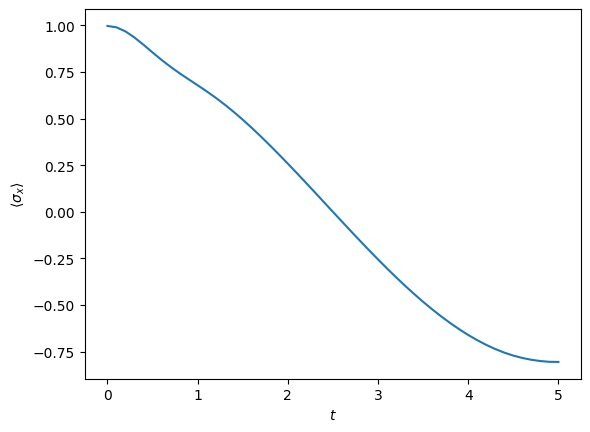
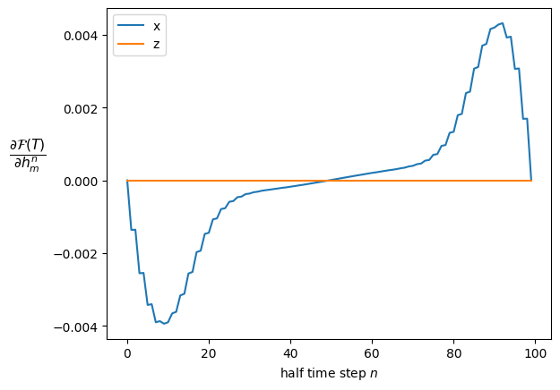

PT Gradient
===========

An example of how to compute the derivative of an objective function of
the final state with respect to a set of system parameters or ‘controls’
using the OQuPy package. A more detailed explanation of the method can
be found in the supplement [Butler2024]
(https://doi.org/10.1103/PhysRevLett.132.060401). \* `launch
binder <https://mybinder.org/v2/gh/tempoCollaboration/OQuPy/HEAD?labpath=tutorials%2Fpt_gradient.ipynb>`__
\* `download the jupyter
file <https://raw.githubusercontent.com/tempoCollaboration/OQuPy/main/tutorials/pt_gradient.ipynb>`__
\* read through the text below and code along

The following packages are required

.. code:: ipython3

    import sys
    sys.path.insert(0,'..')
    import numpy as np
    import oqupy
    from oqupy import operators as op
    import matplotlib.pyplot as plt

The OQuPy version should be ``>=v0.5.0``

.. code:: ipython3

    oqupy.__version__

.. parsed-literal::

    '0.5.0'

Contents
--------

-  `0. Introduction <#introduction>`__

-  `1. Example : Spin Boson Model <#example---spin-boson-model>`__

   -  `1.1 System <#1-system-definition>`__

   -  `1.2 Process Tensor generation <#2-process-tensor-generation>`__

   -  `1.3 Objective Function : The
      Fidelity <#3-objective-function-the-fidelity>`__

   -  `1.4 Adjoint method <#4-adjoint-method>`__

Introduction
------------

The process tensor approach to open quantum systems allows to
efficiently optimize control protocols of non-Markovian open quantum
systems (see [Fux2020, Butler2023]). For this one first computes the
process tensor in MPO form of the given environment interaction and then
repeatedly applies different time-dependent system Hamiltonians. This
has the advantage that each trial system Hamiltonian can be applied with
minimal computational efford to the same precomputed process tensor.

Such a computation of the open dynamics for a set of different
time-dependent system Hamiltonians is demonstrated in the tutorial “Time
dependence and PT-TEMPO”. The search for an optimal protocol can,
however, be accelerated drastically by computing the gradient of the
objective function with respect to some parametrization of the system
Hamiltonian.

In this tutorial we demonstrate the computation of the gradient of some
generic objective function :math:`Z(\rho_f)` which only depends on the
value of the final density matrix :math:`\rho_f`. Let’s assume that we
parametrize the system Hamiltonian with :math:`M` parameters each at
time step. The derivative of the objective function :math:`Z` with
respect to the :math:`m^\mathrm{th}` parameter at the
:math:`n^\mathrm{th}` time step :math:`c_m^n` is

.. math::

   \frac{\partial Z}{\partial c_m^n}=\sum_{i,j,k}^{d_{H_S}^2}
   \frac{\partial Z}{\partial \rho_f^i}
   \frac{\partial\rho_f^i}{\partial U^{jk}_n}
   \frac{\partial U^{jk}_n}{\partial c_m^n},

Where :math:`U_n` are the Liouville system propagators given by the
system Hamiltonian at time step :math:`n`. This expression is depicted
diagramatically in Fig S2 of the supplement in reference [Butler2023].

The three terms in the product are understood as follows: 1.
:math:`\frac{\partial Z}{\partial \rho_f^i}` : The derivative of the
objective function with respect to the final state. This is computed
analytically and corresponds to rank-1 tensor in Liouville space. 2.
:math:`\frac{\partial\rho_f^i}{\partial U^{jk}_n}` : The derivative of
the final state with respect to the propagator at the
:math:`n^{\text{th}}` time-step. Due to the linearity of our network,
this is the same as the diagram for the time-evolution of the initial
state after :math:`N_t` steps with the propagator(s) at the
:math:`n^{\text{th}}` timestep removed. The rank of this tensor depends
on the order of the Trotterization of the propagators. PT-TEMPO
implements a second-order splitting, such that the tensors are
rank-\ :math:`4`. 3. :math:`\frac{\partial U^{jk}_n}{\partial c_m}` :
The derivative of a propagator at the :math:`n^{\text{th}}` timestep
with respect to :math:`m^\mathrm{th}` control parameter at the
:math:`n^\text{th}` timestep. Due to the second Trotterization, there
are :math:`2 N` half-propagators and therefore :math:`2 N`
half-propagator derivatives. These are computed via finite-difference
and are of rank-\ :math:`2`.

Expression 2. is not calculated directly. Rather, we perform a forward
propagation of the initial state :math:`\rho_0` and back propagation of
the target derivative :math:`\frac{\partial Z}{\partial \rho_f^i}` for
:math:`n` time-steps. The stored tensors are of rank-\ :math:`2` with an
external ‘system’ leg which connects to the propagators and an internal
‘bond’ leg connecting to the PT-MPOs. By joining the bond legs of the
appropriate tensors from the forward and back propagations we obtain the
rank-\ :math:`4` tensor $
:raw-latex:`\frac{\partial Z}{\partial \rho_f^i}`
:raw-latex:`\frac{\partial\rho_f^i}{\partial U^{jk}_n}`$ which, when
contracted with the propagator derivatives
:math:`\frac{\partial U^{jk}_n}{\partial c_m}`, gives
:math:`\frac{\partial Z}{\partial c_m^n}`.

As an example, we model a spin-boson system coupled to an external field
and compute the gradient with respect to each parameter.

Example - Spin Boson Model
--------------------------

1. System Definition
~~~~~~~~~~~~~~~~~~~~

We choose the system modelled in the supplement, a spin-boson model
representing a quantum-dot driven by a laser pulse. We consider a
time-dependent system Hamiltonian

.. math::

   H_S = h_x(t) \sigma_x + h_z(t) \sigma_z ,

where the parameters :math:`h_x(t)` and :math:`h_z(t)` represent a set
of fields controlling the system dynamics. This means we parametrize the
system Hamiltonian with two parameters at each time step,
i.e. \ :math:`m\in\{x,z\}` and :math:`c_m^n = h_m(n\, \delta t)`. A
system of this type is represented by a ``ParameterizedSystem`` object.
This object requires a Callable which returns the Hamiltonian for
specific parameters. It encapsulates the system dynamics via calculation
of the propagators :math:`U^{ij}` and propagator derivatives
:math:`\frac{\partial U^{ij}_n}{\partial c_m^n}` using the functions
``get_propagators`` and ``get_propagator_derivatives`` respectively.

.. code:: ipython3

    # function which returns system Hamiltonian for a given set of parameters
    def discrete_hamiltonian(hx,hz):
        return hx*op.sigma('x') + hz*op.sigma('z')
    
    # definition of parameterized system
    system = oqupy.ParameterizedSystem(discrete_hamiltonian)

We then provide a :math:`(2*N,M)`-dimensional tuple of parameters which
define the value of the fields at each half time-step. For simplicity,
we choose a pair of constant fields :math:`h_x=0` and :math:`h_z=\pi/T`.
We choose a pulse duration :math:`T=5 \text{ps}^{-1}` and model over
:math:`100` timesteps. We work in Planck units throughout
(:math:`\hbar = k_B = 1`) and take :math:`\text{ps}^{-1}` as units of
angular momentum.

.. code:: ipython3

    max_time = 5.0
    N = 50 # number of time steps
    dt = max_time/N

.. code:: ipython3

    h_z = np.ones(2*N) * np.pi / (2 * max_time)
    h_x = np.zeros(2*N)
    parameters = np.vstack((h_x,h_z)).T
    parameters.shape

.. parsed-literal::

    (100, 2)

2. Process Tensor generation
~~~~~~~~~~~~~~~~~~~~~~~~~~~~

The bath and interaction Hamiltonians are

.. math::

   H_B = \sum_k \omega_k b_k^\dag b_k 

and

.. math::

   H_{SB} = \frac{1}{2} \sigma_z \sum_k (g_k b_k^\dag + g^*_k b_k),

respectively. The bath interaction terms :math:`g_k` and
:math:`\omega_k` are characterised by the super-ohmic spectral density

.. math::

   J(\omega)  = 2 \alpha \omega^3 \omega_c^{-2} \text{exp}(- \frac{\omega^2}{\omega^2_c}).

with :math:`\omega_c=3.04 \text{p s}^{-1}` and :math:`\alpha=0.126`. We
take the bath to be at :math:`T=5 \text{K}`. The process tensor is then
generated as follows.

.. code:: ipython3

    # spectral density parameters
    alpha = 0.126
    omega_cutoff = 3.04
    temperature = 5 * 0.1309 # 1K = 0.1309/ps in natural units
    
    # numerical tempo parameters
    tcut  = 2.0
    esprel = 10**(-4)
    
    correlations = oqupy.PowerLawSD(
        alpha=alpha,
        zeta=3,
        cutoff=omega_cutoff,
        cutoff_type='gaussian',
        temperature=temperature)
    bath = oqupy.Bath(op.sigma("z")/2, correlations)
    
    tempo_params = oqupy.TempoParameters(dt=dt, tcut=tcut, epsrel=esprel)

.. code:: ipython3

    # process tensor creation
    process_tensor = oqupy.pt_tempo_compute(
        bath=bath,
        start_time=0,
        end_time=max_time,
        parameters=tempo_params
        )

.. parsed-literal::

    --> PT-TEMPO computation:
     52.0%   26 of   50 [####################--------------------] 00:00:00100.0%   50 of   50 [########################################] 00:00:01
    Elapsed time: 1.4s

3. Objective Function: The Fidelity
~~~~~~~~~~~~~~~~~~~~~~~~~~~~~~~~~~~

For our objective function, we choose the fidelity
:math:`\mathcal{F(\rho_t,\rho_f)}` between a target state :math:`\rho_t`
and the final state :math:`\rho_f`. For simplicity, we consider a pure
target state :math:`\rho_t = \ket{\sigma}\bra{\sigma}` such that
:math:`\mathcal{F}=\bra{\sigma} \rho_f \ket{\sigma}`. In Liouville
space, this is expressed as
:math:`\mathcal{F} = \langle \langle \rho_t^T | \rho_f \rangle \rangle = \sum_i^{d_H^2} \rho^T_{t,i} \rho_{f,i}`,
where :math:`| \cdot \rangle \rangle` denotes a vectorized density
matrix and :math:`d_H` the Hilbert space dimension. The derivative with
respect to the final state is then

.. math::

   \frac{\partial \mathcal{F}}{\partial \rho_f} = \rho_t^T.

We model the state transfer between an initial state
:math:`\rho_0=\ket{x+} \bra{x+}` and target state
:math:`\rho_t=\ket{x-} \bra{x-}`.

.. code:: ipython3

    initial_state = op.spin_dm('x+')
    target_state = op.spin_dm('x-')
    target_derivative = target_state.T

4. Adjoint Method
~~~~~~~~~~~~~~~~~

Now that we have defined our objective function, environment and system,
we are able to perform back propagation in order to compute the gradient
and dynamics. This is done via ``state_gradient``. The function computes
:math:`\{\rho(t_n) \}_{n=0,..,N-1}` and
:math:`\{ \frac{\partial Z}{\partial \rho_f^i}\frac{\partial\rho_f^i}{\partial U^{jk}_n} \}_{n=0,...,2N-1}`
using a forward and back propagation of :math:`\rho_0` and $
:raw-latex:`\frac{\partial Z}{\partial \rho_f}`$ as outlined in the
introduction. It then calculates the propagators and propagator
derivatives :math:`\frac{\partial U^{ij}_n}{\partial c_m^n}` using the
parameters and ``ParameterizedSystem`` object. These are finally
combined as in the chain rule to get the derivative of the objective
function with respect to each parameter at each timestep
:math:`\{ \frac{\partial Z}{\partial c_m^n} \}_{m=\{0,...,M-1\},\,n=\{0,...,2N-1\}}`.
The dictionary returned contains: \* ``gradient`` : the list of
gradients
:math:`\{ \frac{\partial Z}{\partial c_m^n} \}_{m=\{0,...,M-1\},\,n=\{0,...,2N-1\}}`
at each half time-step \* ``gradprop`` : the list of tensors
:math:`\{ \frac{\partial Z}{\partial \rho_f^i}\frac{\partial\rho_f^i}{\partial U^{jk}_n} \}_{n=0,...,N-1}`
\* ``dynamics`` : the states and times \* ``final state`` : the final
state

.. code:: ipython3

    # forward-backpropagation + combination of derivatives
    grad_res = oqupy.state_gradient(
        system=system,
        initial_state=initial_state,
        target_derivative=target_derivative,
        process_tensors=[process_tensor],
        parameters=parameters)

.. parsed-literal::

    --> Compute forward propagation:
    100.0%   50 of   50 [########################################] 00:00:00
    Elapsed time: 0.1s
    --> Compute backward propagation:
    100.0%   50 of   50 [########################################] 00:00:00
    Elapsed time: 0.1s
    --> Apply chain rule:
    100.0%   50 of   50 [########################################] 00:00:03
    Elapsed time: 3.9s

We can now plot the dynamics and the gradient:

.. code:: ipython3

    plt.plot(*grad_res['dynamics'].expectations(op.sigma('x'), real=True))
    plt.ylabel(r"$\langle \sigma_x \rangle$")
    plt.xlabel(r"$t$")
    plt.show()
    fidelity = np.real(grad_res['final_state'].flatten() @ target_state.flatten())
    print(f"The fidelity is {fidelity}.")

.. parsed-literal::

    The fidelity is 0.9012528539245532.

.. code:: ipython3

    plt.figure()
    plt.plot(grad_res['gradient'][:,0].real,label='x')
    plt.plot(grad_res['gradient'][:,1].real,label='z')
    plt.legend()
    plt.ylabel(r"$\frac{\partial \mathcal{F}(T)}{\partial h_m^n}$",
               rotation=0,fontsize=16,labelpad=20)
    plt.xlabel(r"half time step $n$")
    plt.show()

Voilà, we have computed the gradient! We can easily plug in another set
of system parameters and rerun the calculation to get the gradient for a
different field. This is particularly useful for optimisation of the
objective function because the long calculation of the process tensor is
done only once. We can do lots of faster calculations of :math:`Z` and
:math:`\frac{\partial Z}{\partial c_m}` for different system parameters
until we find an ‘optimal’ (minima/maxima of :math:`Z` within some
tolerance) set of controls.
