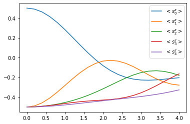
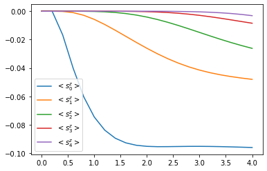

Chains and PT-TEBD
==================

An introduction on how to use the OQuPy package to compute the dynamics
of a chain of open quantum systems using the process tensor approach to
time evolving block decimation (PT-TEBD). We illustrate this by applying
PT-TEBD to a 5-site XYZ Heisenberg spin chain. This method and example
is explained in detail in [Fux2022].

**[Fux2022]** G. E. Fux, D. Kilda, B. W. Lovett, and J. Keeling,
*Thermalization of a spin chain strongly coupled to its environment*,
arXiv:2201.05529 (2022).

-  `launch
   binder <https://mybinder.org/v2/gh/tempoCollaboration/OQuPy/HEAD?labpath=tutorials%2Fpt_tebd.ipynb>`__
   (runs in browser),
-  `download the jupyter
   file <https://raw.githubusercontent.com/tempoCollaboration/OQuPy/main/tutorials/pt_tebd.ipynb>`__,
   or
-  read through the text below and code along.

**Contents:**

-  Example - Heisenberg spin chain

   -  

      1. Closed Heisenberg spin chain

   -  

      2. Open Heisenberg spin chain

First, let’s import OQuPy and some other packages we are going to use

.. code:: ipython3

    import sys
    sys.path.insert(0,'..')
    
    import oqupy
    import numpy as np
    import matplotlib.pyplot as plt

and check what version of tempo we are using.

.. code:: ipython3

    oqupy.__version__

.. parsed-literal::

    '0.3.0'

Let’s also import some shorthands for the spin-1/2 operators and and
density matrices.

.. code:: ipython3

    sx = 0.5 * oqupy.operators.sigma("x")
    sy = 0.5 * oqupy.operators.sigma("y")
    sz = 0.5 * oqupy.operators.sigma("z")
    up_dm = oqupy.operators.spin_dm("z+")
    down_dm = oqupy.operators.spin_dm("z-")
    mixed_dm = oqupy.operators.spin_dm("mixed")

--------------

Example - Heisenberg spin chain
-------------------------------

1. Closed Heisenberg spin chain
~~~~~~~~~~~~~~~~~~~~~~~~~~~~~~~

Let’s calculate the dynamics of a short XYZ Heisenberg spin chain with
the same parameters as in [Fux2022]. Before we include any environment
coupling we first consider the closed chain with the Hamiltonian

.. math::

    H_\mathrm{chain} = \sum_{n=1}^N \epsilon s_n^z
       + \sum_{n=1}^{N-1} \sum_{\gamma \in \{x,y,z\}}
           J^\gamma s_{n}^\gamma s_{n+1}^\gamma \,\mathrm{,}

with :math:`N=5`, :math:`\epsilon=1.0`, :math:`J^x = 1.3`,
:math:`J^y = 0.7`, and :math:`J^z = 1.2`.

.. code:: ipython3

    N = 5
    epsilon = 1.0
    J = [1.3, 0.7, 1.2]
    
    system_chain = oqupy.SystemChain(hilbert_space_dimensions=[2]*N)
    
    for n in range(N):
        system_chain.add_site_hamiltonian(
            site=n,
            hamiltonian=epsilon*sz)
    
    for n in range(N-1):
        for J_gamma, s_gamma in zip(J, [sx, sy, sz]):
            system_chain.add_nn_hamiltonian(
                site=n,
                hamiltonian_l=J_gamma*s_gamma,
                hamiltonian_r=s_gamma)

We begin with an initial chain state where the first spin is ‘up’ (in
the :math:`z`-basis) and all the others are ‘down’.

.. math::

   \tilde{\rho}^A_\mathrm{chain} = | \uparrow \rangle \langle \uparrow |
       \otimes | \downarrow \rangle \langle \downarrow |
       \otimes | \downarrow \rangle \langle \downarrow |
       \otimes | \downarrow \rangle \langle \downarrow |
       \otimes | \downarrow \rangle \langle \downarrow | 

.. code:: ipython3

    initial_augmented_mps_A = oqupy.AugmentedMPS([up_dm, down_dm, down_dm, down_dm, down_dm])

To run a PT-TEBD simulation we need to choose three computation
parameters:

1. The time step length ``dt``,
2. The Trotterization order ``order`` (currently only ``1`` and ``2``
   are implemented), and
3. The relative singular value truncation tolerance ``epsrel``.

We describe details of the computation parameters in the supplemental
material of [Fux2022].

.. code:: ipython3

    pt_tebd_params = oqupy.PtTebdParameters(
        dt=0.2,
        order=2,
        epsrel=1.0e-6)

Next, we insert all this information into a new ``PtTebd`` object to
prepare the simulation. We also specify a list of process tensors that
represent the environment of each site of the chain. Because in this
first example we don’t have any environment, we specify all to be
``None``. The ``dynamics_sites`` parameter allows us to specify a list
of sites whose reduced density matrix shall be recorded during the
propagation.

.. code:: ipython3

    pt_tebd_closed = oqupy.PtTebd(
        initial_augmented_mps=initial_augmented_mps_A,
        system_chain=system_chain,
        process_tensors=[None, None, None, None, None],
        parameters=pt_tebd_params,
        dynamics_sites=[0, 1, 2, 3, 4])

We can then go ahead and set off the actual computation. Let’s (for the
sake of computation time) be modest and say we are only interested in 20
time steps.

.. code:: ipython3

    num_steps = 20
    print("PT-TEBD computation (closed spin chain):")
    results_closed = pt_tebd_closed.compute(num_steps, progress_type="bar")

.. parsed-literal::

    PT-TEBD computation (closed spin chain):
    --> PT-TEBD computation:
    100.0%   20 of   20 [########################################] 00:00:01
    Elapsed time: 1.1s

The computation returns a results dictionary which in addition to the
the dynamics of the before specified sites carries all sorts of other
information about the propagation (such as the total spin chain norm,
the bond dimensions of the augmented MPS, etc.)

.. code:: ipython3

    print(f"Keys of the results dictionary: {results_closed.keys()}")
    print(f"Keys of the dynamics results: {results_closed['dynamics'].keys()}")

.. parsed-literal::

    Keys of the results dictionary: dict_keys(['time', 'norm', 'bond_dimensions', 'dynamics', 'pt_bond_dimensions'])
    Keys of the dynamics results: dict_keys([0, 1, 2, 3, 4])

We can use the dynamics results to then compute the evolution of the
:math:`s^z_n` observables.

.. code:: ipython3

    for site, dynamics in results_closed['dynamics'].items():
        plt.plot(
            *dynamics.expectations(sz, real=True),
            color=f"C{site}", linestyle="solid",
            label=f"$<s_{site}^z>$")
    plt.legend()

.. parsed-literal::

    <matplotlib.legend.Legend at 0x7f672e2d7588>

Yay! We can observe how the excitation travels along the chain.

2. Open Heisenberg spin chain
~~~~~~~~~~~~~~~~~~~~~~~~~~~~~

Now, let’s add a strongly coupled and structured environment to the
chain. We will couple a ohmic bosonic environment to the first spin
through the environment Hamiltonian

.. math::  H^E = \sum_{k}^{\infty} s_1^y \left( g_k b_k^{\dagger} + h.c \right) + \omega_k b_k^{\dagger} b_k \,\mathrm{,}

where :math:`b_k^{(\dagger)}` are the bosonic lowering (raising)
operators, and :math:`s_1^y` is the :math:`y` spin operator of the first
site. The coupling constants :math:`g_k` and frequencies
:math:`\omega_k` are determined by the spectral density

.. math::  J(\omega) = \sum_{k}^{\infty} |g_k|^2 \delta(\omega - \omega_k) = 2 \alpha \, \omega \, e^{-\frac{\omega}{\omega_c}} \,\mathrm{.}

We choose the values :math:`\alpha=0.32` and :math:`\omega_c=4.0`, and
specify that the bosonic environment is initially at temperature
:math:`T=1.6`.

.. code:: ipython3

    alpha = 0.32
    omega_cutoff = 4.0
    temperature = 1.6
    
    correlations = oqupy.PowerLawSD(
        alpha=alpha,
        zeta=1,
        cutoff=omega_cutoff,
        cutoff_type='exponential',
        temperature=temperature)
    bath = oqupy.Bath(sy, correlations)

For the process tensor approach to TEBD, we first need to compute the
process tensors of the environments we wish to add to the TEBD
evolution. For this we choose suitable parameters and carry out the
computation (see Tutorial 02 - Time dependence and PT-TEMPO).

.. code:: ipython3

    tempo_parameters = oqupy.TempoParameters(
        dt=pt_tebd_params.dt,
        dkmax=40,
        epsrel=1.0e-5)

.. code:: ipython3

    print("Process tensor (PT) computation:")
    pt = oqupy.pt_tempo_compute(
        bath=bath,
        start_time=0.0,
        end_time=num_steps * pt_tebd_params.dt,
        parameters=tempo_parameters,
        progress_type='bar')

.. parsed-literal::

    Process tensor (PT) computation:
    --> PT-TEMPO computation:
    100.0%   20 of   20 [########################################] 00:00:00
    Elapsed time: 0.6s

To see the effect of the environment clearly we start in a fully mixed
chain state.

.. code:: ipython3

    initial_augmented_mps_B = oqupy.AugmentedMPS([mixed_dm, mixed_dm, mixed_dm, mixed_dm, mixed_dm])

Again, we prepare a ``PtTebd`` object to collect all necessary
information. We can reuse the before created ``SystemChain`` and
``PtTebdParameters`` objects. This time we set the first item in the
list of process tensors to the process tensor we just computed. This
attaches the above specified environment to the first chain site.
Because we don’t want to couple the other sites to any environment we
keep them free by setting them to ``None``.

.. code:: ipython3

    pt_tebd_open = oqupy.PtTebd(
        initial_augmented_mps=initial_augmented_mps_B,
        system_chain=system_chain,
        process_tensors=[pt, None, None, None, None],
        parameters=pt_tebd_params,
        dynamics_sites=[0, 1, 2, 3, 4],
        chain_control=None)

.. code:: ipython3

    print("PT-TEBD computation (open spin chain):")
    results_open = pt_tebd_open.compute(num_steps, progress_type="bar")

.. parsed-literal::

    PT-TEBD computation (open spin chain):
    --> PT-TEBD computation:
    100.0%   20 of   20 [########################################] 00:00:04
    Elapsed time: 4.3s

.. code:: ipython3

    for site, dyn in results_open['dynamics'].items():
        plt.plot(*dyn.expectations(sz, real=True),
                 color=f"C{site}", linestyle="solid",
                 label=f"$<s_{site}^z>$")
    plt.legend()

.. parsed-literal::

    <matplotlib.legend.Legend at 0x7f671cf195f8>

We can see that the environment starts to hybridize with the first spin
and then the other spins start being affected too.
