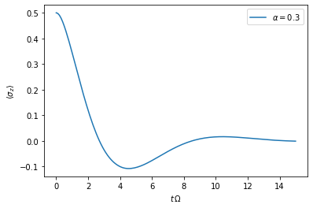
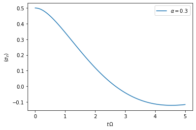
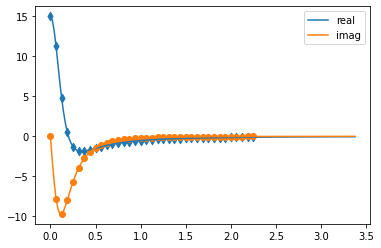
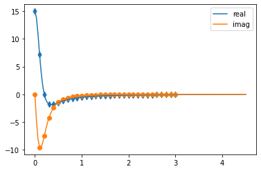

Quickstart
==========

A quick introduction on how to use the OQuPy package to compute the
dynamics of a quantum system that is possibly strongly coupled to a
structured environment. We illustrate this by applying the TEMPO method
to the strongly coupled spin boson model.

-  `launch
   binder <https://mybinder.org/v2/gh/tempoCollaboration/OQuPy/HEAD?labpath=tutorials%2Fquickstart.ipynb>`__
   (runs in browser),
-  `download the jupyter
   file <https://raw.githubusercontent.com/tempoCollaboration/OQuPy/main/tutorials/quickstart.ipynb>`__,
   or
-  read through the text below and code along.

**Contents:**

-  Example - The spin boson model

   -  

      1. The model and its parameters

   -  

      2. Create system, correlations and bath objects

   -  

      3. TEMPO computation

First, let’s import OQuPy and some other packages we are going to use

.. code:: ipython3

    import sys
    sys.path.insert(0,'..')
    
    import oqupy
    import numpy as np
    import matplotlib.pyplot as plt

and check what version of tempo we are using.

.. code:: ipython3

    oqupy.__version__

.. parsed-literal::

    '0.4.0'

Let’s also import some shorthands for the spin Pauli operators and
density matrices.

.. code:: ipython3

    sigma_x = oqupy.operators.sigma("x")
    sigma_y = oqupy.operators.sigma("y")
    sigma_z = oqupy.operators.sigma("z")
    up_density_matrix = oqupy.operators.spin_dm("z+")
    down_density_matrix = oqupy.operators.spin_dm("z-")

--------------

Example - The spin boson model
------------------------------

As a first example let’s try to reconstruct one of the lines in figure
2a of [Strathearn2018] (`Nat. Comm. 9, 3322
(2018) <https://doi.org/10.1038/s41467-018-05617-3>`__ /
`arXiv:1711.09641v3 <https://arxiv.org/abs/1711.09641>`__). In this
example we compute the time evolution of a spin which is strongly
coupled to an ohmic bath (spin-boson model). Before we go through this
step by step below, let’s have a brief look at the script that will do
the job - just to have an idea where we are going:

.. code:: ipython3

    Omega = 1.0
    omega_cutoff = 5.0
    alpha = 0.3
    
    system = oqupy.System(0.5 * Omega * sigma_x)
    correlations = oqupy.PowerLawSD(alpha=alpha,
                                    zeta=1,
                                    cutoff=omega_cutoff,
                                    cutoff_type='exponential')
    bath = oqupy.Bath(0.5 * sigma_z, correlations)
    tempo_parameters = oqupy.TempoParameters(dt=0.1, tcut=3.0, epsrel=10**(-4))
    
    dynamics = oqupy.tempo_compute(system=system,
                                   bath=bath,
                                   initial_state=up_density_matrix,
                                   start_time=0.0,
                                   end_time=15.0,
                                   parameters=tempo_parameters,
                                   unique=False)
    t, s_z = dynamics.expectations(0.5*sigma_z, real=True)
    
    plt.plot(t, s_z, label=r'$\alpha=0.3$')
    plt.xlabel(r'$t\,\Omega$')
    plt.ylabel(r'$\langle\sigma_z\rangle$')
    plt.legend()

.. parsed-literal::

    --> TEMPO computation:
    100.0%  150 of  150 [########################################] 00:00:03
    Elapsed time: 3.9s

.. parsed-literal::

    <matplotlib.legend.Legend at 0x7fbbebf83cd0>

1. The model and its parameters
~~~~~~~~~~~~~~~~~~~~~~~~~~~~~~~

We consider a system Hamiltonian

.. math::  H_{S} = \frac{\Omega}{2} \hat{\sigma}_x \mathrm{,}

a bath Hamiltonian

.. math::  H_{B} = \sum_k \omega_k \hat{b}^\dagger_k \hat{b}_k  \mathrm{,}

and an interaction Hamiltonian

.. math::  H_{I} =  \frac{1}{2} \hat{\sigma}_z \sum_k \left( g_k \hat{b}^\dagger_k + g^*_k \hat{b}_k \right) \mathrm{,}

where :math:`\hat{\sigma}_i` are the Pauli operators, and the
:math:`g_k` and :math:`\omega_k` are such that the spectral density
:math:`J(\omega)` is

.. math::  J(\omega) = \sum_k |g_k|^2 \delta(\omega - \omega_k) = 2 \, \alpha \, \omega \, \exp\left(-\frac{\omega}{\omega_\mathrm{cutoff}}\right) \mathrm{.} 

Also, let’s assume the initial density matrix of the spin is the up
state

.. math::  \rho(0) = \begin{pmatrix} 1 & 0 \\ 0 & 0 \end{pmatrix} 

and the bath is initially at zero temperature.

For the numerical simulation it is advisable to choose a characteristic
frequency and express all other physical parameters in terms of this
frequency. Here, we choose :math:`\Omega` for this and write:

-  :math:`\Omega = 1.0 \Omega`
-  :math:`\omega_c = 5.0 \Omega`
-  :math:`\alpha = 0.3`

.. code:: ipython3

    Omega = 1.0
    omega_cutoff = 5.0
    alpha = 0.3

2. Create system, correlations and bath objects
~~~~~~~~~~~~~~~~~~~~~~~~~~~~~~~~~~~~~~~~~~~~~~~

System
^^^^^^

.. math::  H_{S} = \frac{\Omega}{2} \hat{\sigma}_x \mathrm{,}

.. code:: ipython3

    system = oqupy.System(0.5 * Omega * sigma_x)

Correlations
^^^^^^^^^^^^

.. math::  J(\omega) = 2 \, \alpha \, \omega \, \exp\left(-\frac{\omega}{\omega_\mathrm{cutoff}}\right) 

Because the spectral density is of the standard power-law form,

.. math::  J(\omega) = 2 \alpha \frac{\omega^\zeta}{\omega_c^{\zeta-1}} X(\omega,\omega_c) 

with :math:`\zeta=1` and :math:`X` of the type ``'exponential'`` we
define the spectral density with:

.. code:: ipython3

    correlations = oqupy.PowerLawSD(alpha=alpha,
                                      zeta=1,
                                      cutoff=omega_cutoff,
                                      cutoff_type='exponential')

Bath
^^^^

The bath couples with the operator :math:`\frac{1}{2}\hat{\sigma}_z` to
the system.

.. code:: ipython3

    bath = oqupy.Bath(0.5 * sigma_z, correlations)

3. TEMPO computation
~~~~~~~~~~~~~~~~~~~~

Now, that we have the system and the bath objects ready we can compute
the dynamics of the spin starting in the up state, from time :math:`t=0`
to :math:`t=5\,\Omega^{-1}`

.. code:: ipython3

    dynamics_1 = oqupy.tempo_compute(system=system,
                                       bath=bath,
                                       initial_state=up_density_matrix,
                                       start_time=0.0,
                                       end_time=5.0,
                                       tolerance=0.01,
                                       unique=False)

.. parsed-literal::

    ../oqupy/tempo.py:881: UserWarning: Estimating parameters for TEMPO computation. No guarantee that resulting TEMPO computation converges towards the correct dynamics! Please refer to the TEMPO documentation and check convergence by varying the parameters for TEMPO manually.
      warnings.warn(GUESS_WARNING_MSG, UserWarning)
    WARNING: Estimating parameters for TEMPO computation. No guarantee that resulting TEMPO computation converges towards the correct dynamics! Please refer to the TEMPO documentation and check convergence by varying the parameters for TEMPO manually.

.. parsed-literal::

    --> TEMPO computation:
    100.0%   80 of   80 [########################################] 00:00:01
    Elapsed time: 2.0s

and plot the result:

.. code:: ipython3

    t_1, z_1 = dynamics_1.expectations(0.5*sigma_z, real=True)
    plt.plot(t_1, z_1, label=r'$\alpha=0.3$')
    plt.xlabel(r'$t\,\Omega$')
    plt.ylabel(r'$\langle\sigma_z\rangle$')
    plt.legend()

.. parsed-literal::

    <matplotlib.legend.Legend at 0x7fbb6f953f10>

Yay! This looks like the plot in figure 2a [Strathearn2018].

**Note:** with the option `unique=True` an attempt is made to simplify the
calculation by checking for degeneracies in the eigensystem of the bath
coupling operator. This may greatly decrease the computation time without
significant loss of accuracy. This feature is currently in testing, so if
used we recommend checking results against those obtained with `unqiue=False`
(the default).

We should also address the warning that was given in the above computation:

::

   WARNING: Estimating parameters for TEMPO computation. No guarantee that resulting TEMPO computation converges towards the correct dynamics! Please refer to the TEMPO documentation and check convergence by varying the parameters for TEMPO manually.

We got this message because we didn’t tell the package what parameters
to use for the TEMPO computation, but instead only specified a
``tolerance``. The package tries it’s best by implicitly calling the
function ``oqupy.guess_tempo_parameters()`` to find parameters that are
appropriate for the spectral density and system objects given.

TEMPO Parameters
^^^^^^^^^^^^^^^^

There are **three key parameters** to a TEMPO computation:

-  ``dt`` - Length of a time step :math:`\delta t` - It should be small
   enough such that a trotterisation between the system Hamiltonian and
   the environment it valid, and the environment auto-correlation
   function is reasonably well sampled.

-  ``tcut`` (or ``dkmax``) - Memory cut-off time (or number of steps).
   It must be large enough to capture all non-Markovian effects of the
   environment.

-  ``epsrel`` - The maximal relative error :math:`\epsilon_\mathrm{rel}`
   in the singular value truncation - It must be small enough such that
   the numerical compression (using tensor network algorithms) does not
   truncate relevant correlations.

To choose the right set of initial parameters, we recommend to first use
the ``oqupy.guess_tempo_parameters()`` function and then check with the
helper function ``oqupy.helpers.plot_correlations_with_parameters()``
whether it satisfies the above requirements:

.. code:: ipython3

    parameters = oqupy.guess_tempo_parameters(system=system,
                                              bath=bath,
                                              start_time=0.0,
                                              end_time=5.0,
                                              tolerance=0.01)
    print(parameters)

.. parsed-literal::

    ../oqupy/tempo.py:881: UserWarning: Estimating parameters for TEMPO computation. No guarantee that resulting TEMPO computation converges towards the correct dynamics! Please refer to the TEMPO documentation and check convergence by varying the parameters for TEMPO manually.
      warnings.warn(GUESS_WARNING_MSG, UserWarning)
    WARNING: Estimating parameters for TEMPO computation. No guarantee that resulting TEMPO computation converges towards the correct dynamics! Please refer to the TEMPO documentation and check convergence by varying the parameters for TEMPO manually.

.. parsed-literal::

    ----------------------------------------------
    TempoParameters object: Roughly estimated parameters
     Estimated with 'guess_tempo_parameters()'
      dt                   = 0.0625 
      tcut [dkmax]         = 2.25 [36] 
      epsrel               = 2.4846963223857106e-05 
      add_correlation_time = None 
    

.. code:: ipython3

    fig, ax = plt.subplots(1,1)
    oqupy.helpers.plot_correlations_with_parameters(bath.correlations, parameters, ax=ax)

.. parsed-literal::

    <AxesSubplot:>

In this plot you see the real and imaginary part of the environments
auto-correlation as a function of the delay time :math:`\tau` and the
sampling of it corresponding the the chosen parameters. Sampling points
with spacing ``dt`` are given up to time ``tcut`` (``dkmax`` points). We
can see that the auto-correlation function is close to zero for delay
times larger than approx :math:`2 \Omega^{-1}` and that the sampling
points follow the curve reasonably well. Thus this is a reasonable set
of parameters.

We can choose a set of parameters by hand and bundle them into a
``TempoParameters`` object,

.. code:: ipython3

    tempo_parameters = oqupy.TempoParameters(dt=0.1, tcut=3.0, epsrel=10**(-4), name="my rough parameters")
    print(tempo_parameters)

.. parsed-literal::

    ----------------------------------------------
    TempoParameters object: my rough parameters
     __no_description__
      dt                   = 0.1 
      tcut [dkmax]         = 3.0 [30] 
      epsrel               = 0.0001 
      add_correlation_time = None 
    

and check again with the helper function:

.. code:: ipython3

    fig, ax = plt.subplots(1,1)
    oqupy.helpers.plot_correlations_with_parameters(bath.correlations, tempo_parameters, ax=ax)

.. parsed-literal::

    <AxesSubplot:>

We could feed this object into the ``oqupy.tempo_compute()`` function to
get the dynamics of the system. However, instead of that, we can split
up the work that ``oqupy.tempo_compute()`` does into several steps,
which allows us to resume a computation to get later system dynamics
without having to start over. For this we start with creating a
``Tempo`` object:

.. code:: ipython3

    tempo = oqupy.Tempo(system=system,
                          bath=bath,
                          parameters=tempo_parameters,
                          initial_state=up_density_matrix,
                          start_time=0.0,
                          unique=False)

We can start by computing the dynamics up to time
:math:`5.0\,\Omega^{-1}`,

.. code:: ipython3

    tempo.compute(end_time=5.0)

.. parsed-literal::

    --> TEMPO computation:
    100.0%   50 of   50 [########################################] 00:00:00
    Elapsed time: 0.6s

.. parsed-literal::

    <oqupy.dynamics.Dynamics at 0x7fe003f1dd80>

then get and plot the dynamics of expecatation values,

.. code:: ipython3

    dynamics_2 = tempo.get_dynamics()
    plt.plot(*dynamics_2.expectations(0.5*sigma_z, real=True), label=r'$\alpha=0.3$')
    plt.xlabel(r'$t\,\Omega$')
    plt.ylabel(r'$\langle\sigma_z\rangle$')
    plt.legend()

.. parsed-literal::

    <matplotlib.legend.Legend at 0x7fe003dc13f0>

.. image:: quickstart_files/quickstart_42_1.png

then continue the computation to :math:`15.0\,\Omega^{-1}`,

.. code:: ipython3

    tempo.compute(end_time=15.0)

.. parsed-literal::

    --> TEMPO computation:
    100.0%  100 of  100 [########################################] 00:00:02
    Elapsed time: 2.4s

.. parsed-literal::

    <oqupy.dynamics.Dynamics at 0x7fe003f1dd80>

and then again get and plot the dynamics of expecatation values.

.. code:: ipython3

    dynamics_2 = tempo.get_dynamics()
    plt.plot(*dynamics_2.expectations(0.5*sigma_z, real=True), label=r'$\alpha=0.3$')
    plt.xlabel(r'$t\,\Omega$')
    plt.ylabel(r'$\langle\sigma_z\rangle$')
    plt.legend()

.. parsed-literal::

    <matplotlib.legend.Legend at 0x7fe0083e6d70>

Finally, we note: to validate the accuracy the result **it vital to
check the convergence of such a simulation by varying all three
computational parameters!** For this we recommend repeating the same
simulation with slightly “better” parameters (smaller ``dt``, larger
``tcut``, smaller ``epsrel``) and to consider the difference of the
result as an estimate of the upper bound of the accuracy of the
simulation.

--------------
